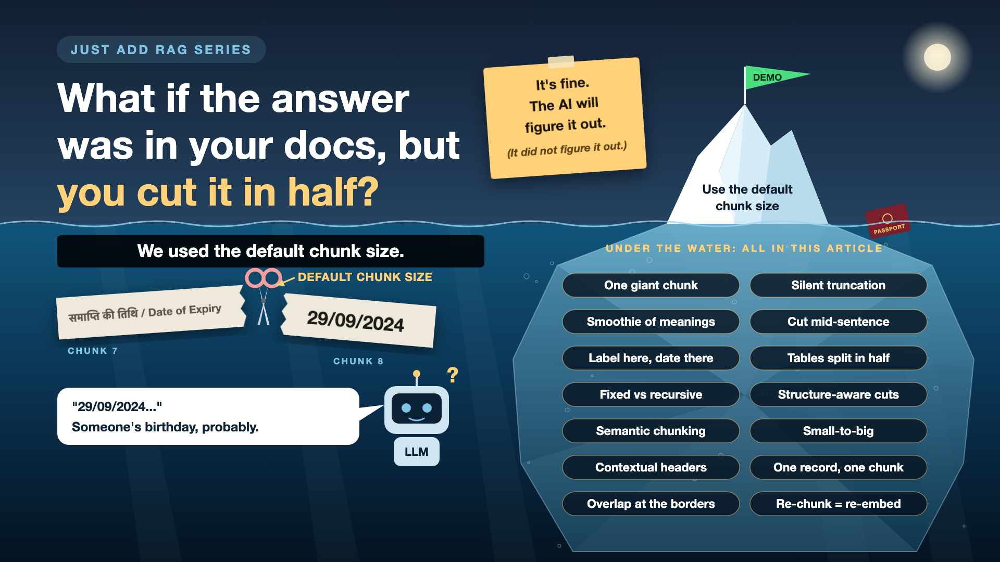

# What If the Answer Was in Your Docs, but You Cut It in Half?

*Just add RAG series: Chunking*

Your documents have the answer. Your AI still can't find it.

Somewhere along the way, the document got cut into pieces. "Date of Expiry" landed in one, "29/09/2024" in the next. One knows a label, the other a date. Neither knows the answer.

That cutting is called chunking: one line of config that quietly decides whether answers are findable at all.

*New to terms like embedding or vector? Cheat sheet at the end.*

## Why cut documents at all?

Why not hand the AI the whole document?

- **The model can't read everything at once.** Its context window has a limit. Ten years of contracts won't fit, and stuffing in whole documents is slow, costly, and buries the one useful line.
- **Search works on pieces.** Each piece becomes one embedding. Focused piece, sharp match. One embedding for a 40-page document is a blurry photo of a crowd.
- **The pieces are all the AI ever sees.** The LLM never reads your document, only the chunks the search hands it.
- **Citations need a precise source.** Good chunks can say "passport, date fields, page 2", not "somewhere in these 40 pages".
- **Grounding needs clean context.** If the chunk says 29/09/2024, so must the answer. Noisy context tempts the model to improvise.
- **You can only test what you can point to.** Evals need a ground truth: this question, this chunk.

Not bad for one line of config.

## My lazy first version: one giant piece

I didn't chunk at all. Each document was cut off at about 8,000 characters, sent to the embedding model (OpenAI's text-embedding-3-small), then stored in Qdrant.

Fine for my one-page passport. For a 40-page policy, page 31 simply never gets embedded. No error, of course. And one vector for a whole document becomes a smoothie of meanings: close to many questions, a great match for none.

*Fix: never embed a long document as one piece, and alert on truncation.*

## The opposite mistake: tiny, blind pieces

The tutorial default is to cut every 500 characters. A character counter will happily split "Date of Expiry" from "29/09/2024", a table header from its rows, or "The customer may cancel" from "only within 14 days". Even clean cuts lose context: "valid until 29/09/2024" doesn't say *what* is valid. Like reading only the last page of a mystery novel.

*Fix: cut by meaning, not just by count.*

## The chunking menu, in plain words

1. **A ruler on a stuffed sandwich**

   Cut every N tokens, whatever's inside. Sometimes a perfect bite, sometimes all bread. Fine for prototypes. That's **fixed-size chunking**.
2. **Cut along the natural lines first**

   Paragraphs, then lines, then sentences, with the ruler only as a last resort. A sensible default. That's **recursive splitting**.
3. **Follow the table of contents**

   Cut at headings, sections and clauses. Best for contracts and policies. That's **structure-aware chunking**.
4. **New topic, new paragraph**

   Cut where the meaning shifts between sentences. Smarter, but costlier at volume. That's **semantic chunking**.
5. **Find the line, read the page**

   Search small chunks, then send the LLM the whole section around the match. That's **parent-child, or small-to-big, chunking**.
6. **The chapter title on every photocopy**

   Stamp the document name and section on every chunk. Cheap, and it rescues the lonely date. These are **contextual chunks**.
7. **Some things shouldn't be cut at all**

   A passport, an invoice, one FAQ answer: already the right size. That's **one record, one chunk**.

Whatever you pick: **overlap** a sentence or two at each border (10-20% is a common start), keep **tables and lists whole** (half a rate card is worse than none), and let a test, not a hunch, decide the **size**.

## Mixing them: how it actually works

Picture a sorting desk where every document gets a ticket saying how to cut it. The passport gets a "do not cut" sticker.

- **Where:** in the ingestion pipeline, between text extraction and embedding. The document-type label from the last write-up picks the rule.
- **How:** a small routing config. Passport or invoice: one chunk. Contract: structure-aware, plus a contextual header. Long report: recursive, about 500 tokens, with overlap and small-to-big. Unknown: recursive, as the safe fallback.
- **Metadata:** every chunk keeps its document, type, section, page and rule version. That's what makes citations, filters and "re-chunk only the contracts" possible.
- **Who decides:** domain experts define a meaningful unit, engineers pick the strategies (LangChain and LlamaIndex supply splitters, the routing is yours), a test settles arguments, and the project owner signs off on cost.

Treat the config like code: versioned, reviewed, tested.

## How do you know it's right?

You can't tell by looking. Every chunk looks reasonable. Take 20 real questions with known answers and check that the right chunk comes back. If it doesn't, no prompt will save you.

And decide early-ish. New chunks mean re-embedding everything. Changing chunk size after go-live is like changing brick size after the house is built. Possible. Not cheap. Mildly upsetting for the people inside.

## Cheat sheet: the words you'll hear, with examples

- **RAG:** find the relevant pieces first, then let the LLM answer from them. *"Can I travel?" finds the passport chunk.*
- **LLM:** the model that writes the answer. *Mine: OpenAI's gpt-4o-mini.*
- **Token:** roughly three-quarters of a word. *"Date of Expiry" is about 4. Hindi needs more.*
- **Context window:** the most tokens a model takes at once. *Desk space.*
- **Chunk:** one searchable piece. *"Date of Expiry: 29/09/2024".*
- **Overlap:** text repeated across a chunk border. *Both chunks carry the expiry line.*
- **Embedding model:** turns text into numbers that capture meaning. *Mine: text-embedding-3-small.*
- **Embedding, or vector:** those numbers. *1,536 of them: \[0.0234, -0.0567, ...\].*
- **Re-embedding:** redoing every embedding after a change. *New chunk size, every document again.*
- **Similarity score:** how close two vectors are. *Passport 0.92, tax return 0.45.*
- **Semantic search:** searching by meaning. *No word "passport" in the question, passport found first.*
- **Vector database:** stores vectors, finds the nearest ones fast. *Mine: Qdrant.*
- **Metadata:** labels on each chunk. *Type: passport. Page: 2.*
- **Citation:** where the answer came from. *"(source: passport, date fields)".*
- **Grounding:** answering only from the given chunks. *Visa question: "not in your documents".*
- **Ground truth:** the answer key for testing. *Expiry question, date chunk, 29/09/2024.*
- **Eval:** a repeatable test against the ground truth. *20 questions: how often did the right chunk come back?*

## Take this to your next kickoff meeting

1. Ask which chunking strategy each document type uses, and why. "We used the default" earns a polite follow-up question.
2. Before anyone tunes a prompt, test 20 real questions: does the right chunk come back?
3. Budget for re-chunking. Every change means re-embedding everything.

An answer being in your documents is not the same as an answer being findable.

Next write-up: **Is your AI hallucinating, or just looking in the wrong place?** (Retrieval)

Follow me for the next one, and tell me the strangest chunk your system ever returned. Half a table counts.

*New to the series? Start with the first write-up: [Why does "Just add RAG" sound like 2 weeks but take 6 months?*](https://www.linkedin.com/pulse/why-does-just-add-rag-sound-like-2-weeks-take-6-months-arpit-jain-l4kkf/)

---

**Post text to share the article:**

> Your documents have the answer. Your AI still can't find it.
>
> Because "Date of Expiry" ended up in one chunk, and "29/09/2024" in the next. One knows a label, the other knows a date, neither knows the answer.
>
> New write-up in my #JustAddRAG series: chunking, the one line of config that decides whether answers are findable, and three things to take to your next kickoff meeting.
>
> What's the strangest chunk your system ever returned?

**Hashtags:** #AIEngineering #RAG #GenAI #EnterpriseAI #JustAddRAG

**Update the pinned index comment on the first write-up (and post the same as the first comment here):**

> 📌 Just add RAG: series index
>
> Why does "Just add RAG" sound like 2 weeks but take 6 months? https://www.linkedin.com/pulse/why-does-just-add-rag-sound-like-2-weeks-take-6-months-arpit-jain-l4kkf/
>
> Why can't your AI read a PDF that a 10-year-old can? https://www.linkedin.com/pulse/why-cant-your-ai-read-pdf-10-year-old-can-arpit-jain-fimif/
>
> What if the answer was in your docs, but you cut it in half? \[link\]
>
> Is your AI hallucinating, or just looking in the wrong place? (next write-up)
