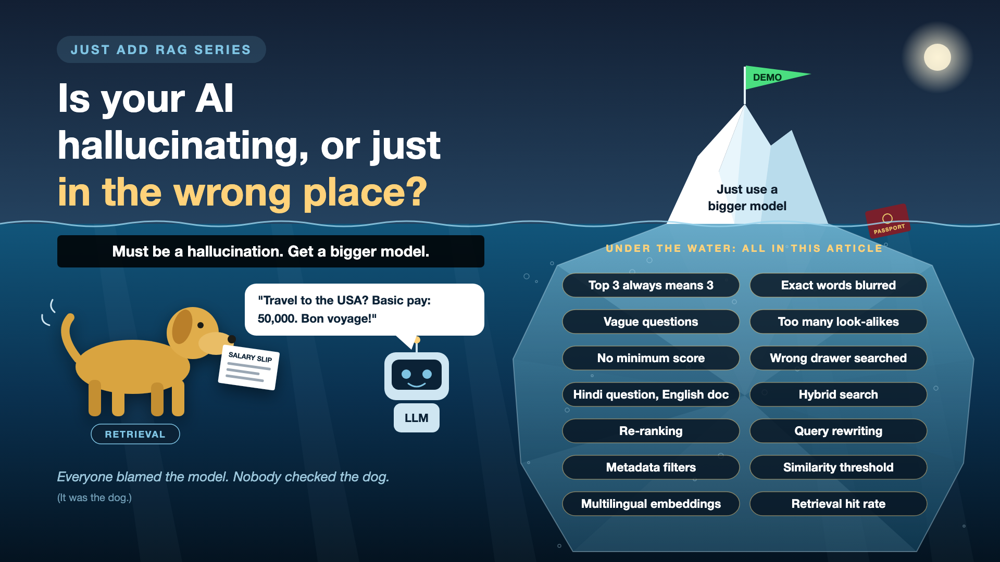

# Is Your AI Hallucinating, or Just Looking in the Wrong Place?

*Just add RAG series: Retrieval*

The AI gave a wrong answer. Someone in the room says the word: "hallucination". Everyone nods. Someone suggests a bigger model.

But often the model didn't make anything up. It answered faithfully, from the wrong page. Like a brilliant student handed the wrong chapter before the exam.

The part that picks the page is called retrieval. When it misses, the smartest model in the world becomes a very confident guesser.

*New to terms like hybrid search or re-ranking? Cheat sheet at the end.*

## Why retrieval decides the answer

- **The LLM only knows what it's handed.** In RAG, the model answers from the few chunks the search returns. Wrong chunks in, confident wrong answer out.
- **It hides behind the model.** A retrieval miss looks exactly like a hallucination from the outside. So teams fix the wrong thing.
- **It's the cheaper fix.** Better search costs far less than a bigger model. Before you buy a bigger brain, check the eyes.
- **It can be measured on its own.** You can test "did the right chunk come back?" without the LLM involved at all. That makes it the easiest part to improve with confidence.

## What happened with my passport

I asked: "Can I travel to the USA next week?" My search in Qdrant was set to return the top 3 matches, with no minimum score. It returned:

- My passport: **0.92**
- My tax return: **0.45**
- My salary slip: **0.38**

All three went into the prompt for gpt-4o-mini. Top 3 always means three, even when two of them are irrelevant. Like a waiter who brings three dishes whether or not the kitchen made anything you ordered.

With three documents, harmless. With three hundred, the passport might not make the top 3 at all. The model would then answer, beautifully and confidently, from my salary slip.

## Six ways search misses

- **Exact words get blurred.** Search by meaning is great for "travel" and "passport", and surprisingly bad at "Form 16", "HRA" or an error code. Close enough isn't good enough for an ID. *Fix: combine meaning search with keyword search.*
- **Vague questions.** "Is it still valid?" What is "it"? The search has no idea. *Fix: rewrite the question, using the conversation, before searching.*
- **Too many look-alikes.** Five versions of a travel policy all score about the same. The ranking is rough, and the right one lands fourth. *Fix: a second, pickier ranking step.*
- **No floor.** Top 3 always returns three, even when nothing is relevant. *Fix: a minimum score, and an honest "nothing found".*
- **Wrong drawer.** A travel question shouldn't be searching salary slips. *Fix: filter by labels like document type, owner and date before searching.*
- **Wrong language.** "क्या मेरा पासपोर्ट वैध है?" ("Is my passport valid?") asked in Hindi, against documents stored mostly in English. Some embedding models handle this well, some quietly don't. *Fix: test in every language your users actually speak, and use a multilingual embedding model or translate the question first.*

## The retrieval toolkit, in plain words

1. **Ask two librarians**

   One finds books by meaning, the other by exact words. You take the best of both. That's **hybrid search** (vector search plus keyword search, often BM25).
2. **A second, pickier opinion**

   Fetch 20 candidates quickly, then let a slower, more careful model re-order them and keep the best 3. That's **re-ranking**.
3. **Say it properly before you ask**

   Turn "is it still valid?" into "is my passport still valid for travel?" before searching. That's **query rewriting**.
4. **Only open the right drawer**

   Search passports for travel questions, and only this user's documents. Mine filtered by user ID in Qdrant from day one. That's **metadata filtering**.
5. **"Nothing good enough" is an answer**

   If the best match scores below a set bar, return nothing instead of the least-bad guess. That's a **similarity threshold**.
6. **Speak both languages**

   A model that places "पासपोर्ट" and "passport" close together. That's a **multilingual embedding model**.

## How it fits together

In a real system, these run one after another, in the retrieval layer between the user's question and the LLM:

1. Rewrite the question.
2. Filter to the right drawer: this user, this document type.
3. Hybrid search for about 20 candidates.
4. Re-rank and keep the top 3.
5. Drop anything below the threshold.
6. Hand what's left to the LLM, or say "I couldn't find this".

Each step adds a little time and cost. Re-ranking is the slowest. **Engineers** tune the steps, **domain experts** supply real test questions, and the **project owner** decides how much speed to trade for accuracy.

## How do you know it's working?

Test retrieval on its own. Take 20-50 real questions, in every language your users speak, and check one thing: was the right chunk in the top 3?

This also gives you a simple rule for every wrong answer:

- **Right chunk retrieved, wrong answer:** a model or prompt problem.
- **Right chunk missing:** a search problem. No bigger model will fix it.

## Cheat sheet: the words you'll hear, with examples

New in this write-up. (Embedding, vector, chunk and similarity score are in the chunking write-up's cheat sheet.)

- **Hallucination:** the model stating something not supported by its sources. *Inventing visa rules no document mentions.*
- **Retrieval:** finding the chunks to hand the LLM. *Fetching my passport for a travel question.*
- **Top-k:** how many results the search returns. *Mine: k = 3.*
- **Cosine similarity:** the usual way to score how close two vectors are. *Mine, in Qdrant: passport 0.92.*
- **Keyword search (BM25):** the classic exact-word search. *Finds "Form 16" when meaning search shrugs.*
- **Hybrid search:** keyword and meaning search combined. *"Form 16" and "tax proof" both work.*
- **Re-ranking:** a second, more careful sort of the first results. *20 candidates in, best 3 out.*
- **Query rewriting:** making the question clear before searching. *"Is it valid?" becomes "Is my passport valid?"*
- **Metadata filtering:** searching only chunks with the right labels. *Mine: user ID filter in Qdrant.*
- **Similarity threshold:** the minimum score to count as a match. *Below the bar, the salary slip stays out.*
- **Multilingual embedding model:** one that understands several languages in one space. *Hindi question, English passport, still a match.*
- **Hit rate (or recall@k):** how often the right chunk lands in the top k. *18 of 20 test questions: 90%.*

## Take this to your next kickoff meeting

1. When someone says "hallucination", ask first: was the right document even retrieved?
2. Ask for the retrieval hit rate on real questions, in every language your users speak.
3. Before paying for a bigger model, try hybrid search, re-ranking and a score threshold.

Many hallucinations are search problems wearing a model costume.

Next write-up: **What does your AI say when it doesn't know?** (Grounding and citations)

Follow me for the next one. And tell me: what's the most confident wrong answer your AI ever gave? Bonus question: was it the search?

*New to the series? Start with the first write-up: [Why does "Just add RAG" sound like 2 weeks but take 6 months?](https://www.linkedin.com/pulse/why-does-just-add-rag-sound-like-2-weeks-take-6-months-arpit-jain-l4kkf/)*

---

**Post text to share the article:**

> My RAG assistant was asked about travel. It found my passport. It also found my tax return and my salary slip, and sent all three to the model.
>
> Because top 3 always means three. Even when the kitchen is closed.
>
> New write-up in my #JustAddRAG series: why many "hallucinations" are really search misses, six ways retrieval goes wrong (including questions in Hindi), and three things to take to your next kickoff meeting.
>
> What's the most confident wrong answer your AI ever gave?

**Hashtags:** #AIEngineering #RAG #GenAI #EnterpriseAI #JustAddRAG

**Update the pinned index comment on the first write-up (and post the same as the first comment here):**

> 📌 Just add RAG: series index
>
> Why does "Just add RAG" sound like 2 weeks but take 6 months? https://www.linkedin.com/pulse/why-does-just-add-rag-sound-like-2-weeks-take-6-months-arpit-jain-l4kkf/
>
> Why can't your AI read a PDF that a 10-year-old can? https://www.linkedin.com/pulse/why-cant-your-ai-read-pdf-10-year-old-can-arpit-jain-fimif/
>
> What if the answer was in your docs, but you cut it in half? \[link\]
>
> Is your AI hallucinating, or just looking in the wrong place? \[link\]
>
> What does your AI say when it doesn't know? (next write-up)
