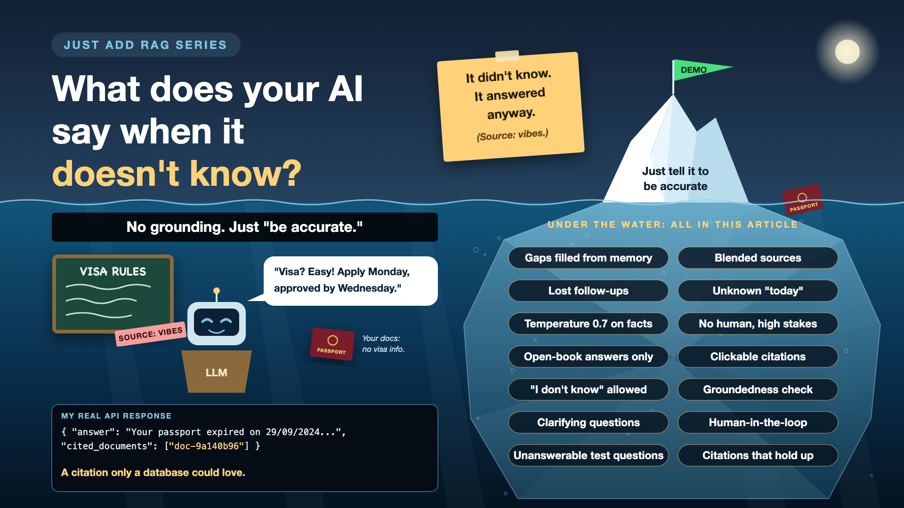

# What Does Your AI Say When It Doesn't Know?

*Just add RAG series: Grounding and citations*

Ask a good new colleague something they don't know, and they'll say, "Let me check." Ask an LLM, and you'll usually get a fluent, confident paragraph. LLMs are trained to be helpful. Awkward silence isn't in the training plan.

I asked my document assistant: "Do I need a visa for the USA?" None of my documents mention a visa. A model left to itself will still answer, from general knowledge, in a tone that sounds exactly like it read it in my files. Like a very confident uncle at a family wedding.

Keeping the AI's answers tied to your documents is called grounding. Showing where each answer came from is called citation. Together, they decide whether people can trust what the AI says.

*New to terms like grounding or abstention? Cheat sheet at the end.*

## Why "I don't know" is worth designing for

- **Trust is lopsided.** One confident wrong answer undoes ten right ones. Users don't remember the ten.
- **A guess is a liability.** In HR, legal, finance or health, a made-up answer isn't a bug. It's a risk with your company's name on it.
- **Sources make answers checkable.** With a citation, a user can verify in seconds. Without one, they either trust blindly or stop using it.
- **You can't fix what you can't trace.** When an answer is wrong, citations show which chunk misled the model, and which team owns the fix.

## What my assistant got right, and not quite

**Right:** the system prompt told gpt-4o-mini to check expiry dates against today's date, and I passed today's date in with every question, because the model doesn't know what day it is. My API also returned the source it used.

**Not quite:** that source came back as `cited_documents: ["doc-9a140b96"]`. A citation only a database could love. No user can click that and check it. My prompt's rules were all about dates and travel eligibility, not about what to say when the documents are silent. And it ran at a temperature of 0.7, a setting that's lovely for poetry and less lovely for passports.

## Six ways answers drift from your documents

- **Filling gaps from memory.** No document mentions a visa, so the model uses what it learned on the internet. *Fix: instruct it to answer only from the provided context, and to say "not in your documents" otherwise.*
- **Blending sources.** The passport date and the tax return's address end up in one sentence, and nobody can tell which came from where. *Fix: cite per sentence, not per answer.*
- **Losing the thread.** "And what about my wife's?" Whose what? *Fix: carry the conversation into the search, and let the AI ask a clarifying question when unsure.*
- **Not knowing today.** "Is it still valid?" depends on the date, which the model doesn't know. *Fix: pass the current date in, every time. I did.*
- **Creative settings on factual work.** A higher temperature adds variety, which is the last thing you want in a date. *Fix: keep temperature low for factual answers.*
- **High stakes, no human.** Some answers shouldn't go out on the AI's word alone. *Fix: route sensitive topics, or low-confidence answers, to a person first.*

## The grounding toolkit, in plain words

1. **An open-book exam, with only one book**

   The model may answer only from the pages it was handed, not from everything it ever read. That's **grounded generation**.
2. **Show your working**

   Every claim points to the exact page it came from, in a form a person can open. That's **citation**, or source attribution.
3. **Permission to say "I don't know"**

   When the pages don't hold the answer, saying so is the correct answer, and the prompt says that out loud. That's **abstention**.
4. **A fact-checker reads the draft**

   Before the answer goes out, a second check confirms each sentence is supported by the cited chunk. That's a **groundedness check**.
5. **When unsure, ask**

   "Do you mean your passport or your wife's?" beats a confident guess. That's a **clarifying question**.
6. **A human signs the important ones**

   Legal, medical or money answers wait for a person's approval. That's **human-in-the-loop review**.

## How it works in practice

This lives right after retrieval, around the LLM call:

- The prompt allows answers only from the given chunks, and spells out the "not found" reply.
- The model answers with chunk IDs. The system maps them to names people understand, like "Passport, page 2", using the metadata stored with each chunk (mine is in PostgreSQL).
- A groundedness check runs. If it fails, or retrieval found nothing good enough, the user gets an honest "I couldn't find this in your documents".
- Sensitive topics go to a review queue instead of straight to the user.

**Product and legal** decide which topics need a human and how "I don't know" should sound. **Engineers** build it. **Domain experts** write the test questions.

## How do you know it works?

Add questions your documents *can't* answer to your test set. The visa question is mine. Then check two things:

- **Does it refuse when it should?** A wrong answer to an unanswerable question is the worst kind of wrong.
- **Do the citations hold up?** Open the cited source. Does it actually say what the answer claims?

## Cheat sheet: the words you'll hear, with examples

New in this write-up, plus two quick refreshers.

- **Grounding (refresher):** answering only from the given chunks. *Visa question: "not in your documents".*
- **Citation (refresher):** where the answer came from. *Better: "Passport, page 2". Mine: doc-9a140b96.*
- **System prompt:** standing instructions the model reads before every question. *Mine: "You are a document analyzer. You MUST check expiry dates against today's date."*
- **Context:** the chunks pasted into the prompt for this question. *My passport text, about a thousand characters.*
- **Temperature:** how much variety the model adds to its wording. *Mine: 0.7. For facts, lower is safer.*
- **Grounded generation:** answering strictly from the context. *No document, no visa advice.*
- **Abstention:** deliberately declining to answer. *"I couldn't find this in your documents."*
- **Unanswerable question:** a test question your documents can't answer. *"Do I need a visa for the USA?"*
- **Groundedness check:** verifying each sentence is supported by its source. *"Expired on 29/09/2024": found in the passport chunk. Pass.*
- **Clarifying question:** the AI asking before guessing. *"Your passport, or your wife's?"*
- **Human-in-the-loop:** a person approves certain answers before they go out. *A lawyer checks contract answers first.*
- **Audit trail:** a stored record of questions, answers and sources. *Mine: chat history in PostgreSQL.*

## Take this to your next kickoff meeting

1. Ask to see what the AI says to a question your documents can't answer.
2. Insist on citations a user can click and check, not database IDs.
3. Decide before launch which answers need a human to approve them.

The AI that can say "I don't know" is the one people end up trusting.

Next write-up: **Is your chatbot answering a question that needs a database?** (Picking the right tool)

Follow me for the next one. And tell me: what's the best "I don't know" you've seen from an AI? Or the most confident guess?

*New to the series? Start with the first write-up: [Why does "Just add RAG" sound like 2 weeks but take 6 months?](https://www.linkedin.com/pulse/why-does-just-add-rag-sound-like-2-weeks-take-6-months-arpit-jain-l4kkf/)*

---

**Post text to share the article:**

> I asked my document assistant: "Do I need a visa for the USA?"
>
> None of my documents mention a visa. A model left to itself would still answer, confidently, as if it read it in my files.
>
> New write-up in my #JustAddRAG series: grounding, citations a person can actually check, and why "I don't know" is a feature worth designing for. Plus three things to take to your next kickoff meeting.
>
> What's the best "I don't know" you've seen from an AI?

**Hashtags:** #AIEngineering #RAG #GenAI #EnterpriseAI #JustAddRAG
