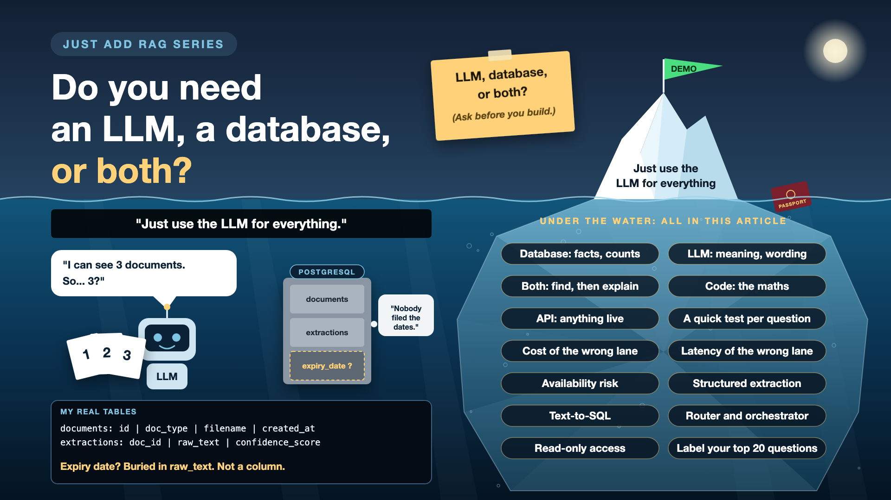

# 6. Do You Need an LLM, a Database, or Both?



*Just add RAG series: LLM, database, or both*

Every AI kickoff quietly assumes the answer is an LLM. Often it's a database. Sometimes it's both.

"Which of my documents expire this year?" sounds like a perfect question for an AI assistant. It isn't. It's a database query wearing a chatbot costume. RAG finds a few relevant passages and answers from them. This question needs every document checked, every date compared, and a list counted. A simple database query does that in milliseconds.

But "What does my renewal policy say about lost passports?" is the opposite. No database column holds that. It needs reading and understanding. That's LLM work.

And "Which documents expire this year, and what do I need to renew them?" needs both.

*New to terms like text-to-SQL or query routing? Cheat sheet at the end.*

## Why this choice matters

- **An LLM sees a few chunks, not everything.** RAG answers from the top 3 results. Ask "how many?" and it counts what it was handed, not what you have.
- **The wrong choice still sounds right.** An incomplete list arrives in perfect sentences. Nobody notices the missing items.
- **Users don't know the difference.** They just ask. Deciding which kind of question it is, is the system's job, not theirs.
- **It shapes cost, speed and uptime.** More on that below.

## What my assistant could, and couldn't, answer

My PostgreSQL database already had a `documents` table, with each document's type, file name and upload date, and an `extractions` table holding the OCR text.

So "how many documents have I uploaded?" was one SQL line away. No LLM needed. But "which documents expire this year?" wasn't, because the expiry date lived only inside the raw text: `समाप्ति की तिथि 29/09/2024`. Not in a column anyone could query. The answer existed. It just wasn't anywhere a database could count it.

## Three lanes: database, LLM, or both

**Database only.** Exact facts, counts, totals, lists, comparisons and lookups.
- "How many documents do I have?"
- "Which documents expire this year?" (once the date is in a column)
- "Did my salary go up between March and April?"

**LLM only (RAG).** Meaning, wording, summaries and explanations.
- "What does my travel policy say about lost baggage?"
- "Summarise the renewal rules in plain English."

**Both.** The database finds, the LLM explains.
- "Which documents expire this year, and what do I need to renew them?" The database lists the documents; the LLM reads the renewal policy and writes one answer.

Two more lanes sit next to these. **Code**, for calculations like "how many days until my passport expires?", because LLMs are great with words and slightly creative with arithmetic. And **live systems through an API**, for anything no document knows, like "is my visa appointment confirmed?"

## A quick test for every question

1. **Is the answer an exact fact, number or list?** Use the database.
2. **Does it need understanding or wording?** Use the LLM.
3. **Both?** Database to find, LLM to explain.
4. **Is it maths?** Use code. **Is it live?** Call the system that owns it.

## It's not just about the right answer

Using an LLM where a database would do doesn't only risk a wrong answer. It quietly hurts every non-functional requirement too, the "how well" qualities nobody demos but every user feels:

- **Cost.** RAG pays for an embedding call, a vector search and an LLM call over several chunks, every single time. A database count costs almost nothing. *Why it matters: thousands of counting questions a day turn into a real bill.*
- **Latency.** My RAG answers took 3 to 5 seconds. A database query takes milliseconds. *Why it matters: users wait for every answer, and slow answers get abandoned.*
- **Availability.** My RAG answer depended on OpenAI's embedding API, Qdrant and the LLM API. The database answer depends only on my own database. *Why it matters: when the AI provider is down, the database questions can still work.*
- **Performance at scale.** Heavy LLM work for simple counts queues up behind the real search questions. Databases are built for counts and filters, and their answers can be cached. *Why it matters: under load, everything slows down, not just the counting questions.*
- **Accuracy and consistency.** RAG counts only what it was handed. The database checks every row, and gives the same answer every time. *Why it matters: a count that changes with each ask isn't a count.*

The reverse mistake hurts too. Forcing meaning questions into SQL gives rigid, keyword-only answers that miss what the user actually asked.

Two honest trade-offs. Deciding the lane adds a small step, so keep it light. And text-to-SQL uses an LLM call too, but just once, to write one precise query, instead of searching and stuffing chunks into a prompt.

## The toolkit, in plain words

1. **A receptionist at the front desk**

   Every question is sent to the right counter: database, LLM, calculator or live system. That's **query routing**.
2. **File the facts when the mail arrives**

   When a document is uploaded, pull out its key facts (expiry date, amounts, IDs) into proper columns. That's **structured extraction**.
3. **Turn the question into a database query**

   "Which documents expire this year?" becomes a query the database can run. That's **text-to-SQL**.
4. **Use a calculator, not mental maths**

   The LLM asks a piece of code to do the date maths and uses the result. That's **tool calling**.
5. **Ask the source directly**

   For anything live, call the system that owns the truth. That's an **API tool**.
6. **Find with the database, explain with the AI**

   The database lists the expiring documents. The LLM writes the friendly summary. That's **hybrid SQL plus RAG**.

## How it works in practice

The router is the first step after the question arrives.

```
                     User question
                           |
                           v
                 +-------------------+
                 |      ROUTER       |
                 | (rules, a small   |
                 |  classifier, or   |
                 |  the LLM itself)  |
                 +-------------------+
                           |
     +------------+--------+---------+-------------+
     |            |                  |             |
     v            v                  v             v
+---------+  +----------+  +--------------+  +-----------+
| MEANING |  |  FACTS   |  |    MATHS     |  |   LIVE    |
|  (LLM)  |  |  (SQL)   |  |   (code)     |  |   (API)   |
+---------+  +----------+  +--------------+  +-----------+
 "What does   "Which docs   "Days until my   "Is my visa
  the policy   expire this    passport         appointment
  say?"        year?"         expires?"        confirmed?"
     |            |                  |             |
     +------------+--------+---------+-------------+
                           |
                           v
                 +-------------------+
                 |  LLM writes the   |
                 |  final answer     |
                 +-------------------+
```

**Who decides?** At design time, people decide which question types go to which lane. At runtime, the router decides for each question: simple rules, a small classifier, or the LLM itself choosing from a list of tools. Mixed questions, like "Which documents expire this year, and what do I need to renew them?", need an orchestrator that runs the steps in order: database first, then documents, then one combined answer. Start simple, with fixed code paths, and only let the LLM choose when the questions get too varied.

Text-to-SQL needs guard rails:

- **Read-only** database access. The AI reads, never writes.
- Only **approved tables**, always filtered to **this user's rows**.
- A **row limit**, and every generated query logged.

**Product** decides which question types to support. **Data owners** decide which tables the AI may see. **Security** reviews the access. **Engineers** build the router.

## How do you know it works?

List the 20 questions users ask most, and label each: database, LLM, both, code or live. Then test two things: did the router pick the right lane, and was the answer right? A correct answer from the wrong lane is luck, not design.

## Cheat sheet: the words you'll hear, with examples

- **Structured data:** facts in tables with named columns. *My `documents` table: type, file name, upload date.*
- **Unstructured data:** free text, scans and PDFs. *My passport's OCR text in the `extractions` table.*
- **Schema:** the layout of a database: tables, columns, types. *`documents` has `doc_type`, `filename`, `created_at`.*
- **SQL:** the standard language for asking a database questions. *"Count my documents where type is passport."*
- **Aggregation:** combining many rows into one answer: count, sum, average. *"How many documents do I have?"*
- **Query routing:** sending each question to the right lane. *Policy question to the LLM, counting question to SQL.*
- **Intent:** what kind of question it is. *"Which expire this year?": a list, not a search.*
- **Structured extraction:** pulling key facts into columns at upload time. *Expiry date 29/09/2024 saved as a date column.*
- **Text-to-SQL:** an LLM turning a question into a database query. *"Which expire this year?" becomes a query on the expiry column.*
- **Tool calling (or function calling):** the LLM asking code to do a job. *A date function returns the days until expiry.*
- **API:** a way for one system to ask another for live data. *The visa appointment system.*
- **Read-only access:** permission to read, never change. *The AI can list documents, not delete them.*
- **NFR (non-functional requirement):** how well a system works, not what it does: cost, speed, uptime, scale. *A 3-second answer and a 20-millisecond answer can both be correct. Only one feels fast.*
- **Router:** the step that decides which lane handles each question. *"How many" goes to SQL, "what does it say" goes to the LLM.*
- **Orchestrator:** the code or framework that runs several steps in order and combines their results. *Database list first, then policy search, then one answer.*

## Take this to your next kickoff meeting

1. Before saying "LLM", list the top 20 questions users will ask, and label each: database, LLM, both, code or live.
2. Pull key facts like dates, amounts and IDs into columns when documents arrive, not when questions do.
3. Give the AI read-only, user-filtered database access, never the keys to everything.

The best AI systems use the LLM where it shines, and a plain database everywhere else.

Next write-up (7): **What happens when your AI finds two versions of the truth?** (Versions and ownership)

Follow me for the next one. And tell me: what's a question your users asked an AI that really needed a spreadsheet?

**Earlier in this series:**

1. [Why does "Just add RAG" sound like 2 weeks but take 6 months?](https://www.linkedin.com/pulse/why-does-just-add-rag-sound-like-2-weeks-take-6-months-arpit-jain-l4kkf/)
2. [Why can't your AI read a PDF that a 10-year-old can?](https://www.linkedin.com/pulse/why-cant-your-ai-read-pdf-10-year-old-can-arpit-jain-fimif/)
3. [What if the answer was in your docs, but you cut it in half?](https://www.linkedin.com/pulse/what-answer-your-docs-you-cut-half-arpit-jain-pczxf/)
4. [Is your AI hallucinating, or just looking in the wrong place?](https://www.linkedin.com/pulse/your-ai-hallucinating-just-looking-wrong-place-arpit-jain-byozf/)
5. [What does your AI say when it doesn't know?](https://www.linkedin.com/pulse/5-what-does-your-ai-say-when-doesnt-know-arpit-jain-wr5bf)

---

**Post text (copy and paste):**

```
Every AI kickoff assumes the answer is an LLM. Often it's a database. Sometimes it's both.

"Which of my documents expire this year?" isn't an AI question. It's a database query wearing a chatbot costume.

Use an LLM where a database would do, and you pay for it:
• Accuracy: it counts only the 3 chunks it was handed, so the list is quietly incomplete
• Latency: seconds instead of milliseconds
• Cost: an embedding, a search and an LLM call, for a question SQL answers almost free
• Availability: it fails whenever the AI provider is down
• Trust: the answer changes each time you ask

Write-up 6 in my #JustAddRAG series: the three lanes (database, LLM, or both), a quick test for every question, who decides the route, and three things to take to your next kickoff meeting.

Which questions in your AI project never needed an LLM at all?

#AIEngineering #RAG #GenAI #EnterpriseAI #JustAddRAG
```
