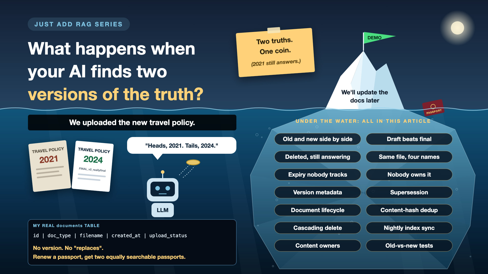

# 7. What Happens When Your AI Finds Two Versions of the Truth?

*Just add RAG series: Versions and ownership*

Imagine I finally renew my passport and upload the new one. Now my assistant has two passports, two expiry dates, and both look equally relevant to "Can I travel?"

Which one wins? Whichever the search happens to rank higher that day.

In a company, it's the 2021 travel policy competing with the 2024 one. Or `Policy_final_v2_FINAL_reallyfinal.docx` competing with all its ancestors. The old version doesn't retire. It keeps answering questions, like a retired colleague who still comes to the office out of habit.

*New to terms like supersede or content hash? Cheat sheet at the end.*

## Why versions deserve a plan

- **Stale answers are silent.** An outdated answer looks exactly like a correct one. Nobody gets an error message saying "this was true in 2021".
- **Newest isn't always right.** The latest upload might be a draft. The approved version might be older.
- **Deleting a file doesn't delete the memory.** Remove a document from the shared drive, and its chunks can live on in the search index for months.
- **Documents keep changing after go-live.** The demo used a frozen folder. Real life doesn't.

## What my assistant would have done

My `documents` table in PostgreSQL records each file's type, name, upload time and status. Useful. But nothing in it says "this document replaces that one". Upload a renewed passport, and both passports become equally searchable in Qdrant. Two passports walk into a vector database, and neither leaves.

## Six ways versions go wrong

- **Old and new side by side.** Both get retrieved, and the answer mixes them. *Fix: when a new version arrives, mark the old one as replaced, and search only current versions.*
- **Draft beats final.** The newest upload is a work in progress. *Fix: give every document a status, and only let approved ones answer.*
- **Deleted, but still answering.** The file is gone from the drive, its chunks aren't gone from the index. *Fix: delete everywhere at once: file store, database, vector index.*
- **Same file, four names.** `policy.pdf`, `policy (1).pdf`, `policy_final.pdf`, all identical, all retrieved. *Fix: spot duplicates by content, not by file name.*
- **Expiry nobody tracks.** A policy valid until March is still answering in June. *Fix: store "valid from" and "valid until" dates, and filter on them.*
- **Nobody owns it.** The project team built the index and moved on. *Fix: name a content owner for every document collection before go-live.*

## The version toolkit, in plain words

1. **Stamp the date on every page**

   Each chunk carries its version number and the dates it's valid for. That's **version metadata**.
2. **Old copies go to the archive drawer**

   When a new version arrives, the old one is marked as replaced and stops answering. That's **supersession**.
3. **Only the signed copy counts**

   Every document is a draft, approved or retired, and only approved ones are searchable. That's a **document lifecycle**.
4. **Spot the photocopies**

   A fingerprint of each file's content catches duplicates, whatever they're called. That's **deduplication** using a **content hash**.
5. **Remove it everywhere, not just from the shelf**

   One delete clears the file, its database rows and its vectors. That's a **cascading delete**.
6. **Keep the copy in step with the original**

   A regular job compares the source folder with the index and updates only what changed. That's **index sync**, or incremental re-indexing.
7. **Somebody's name on the shelf**

   A named person decides what's current for each collection. That's **content ownership**.

## How it works in practice

- **At upload:** fingerprint the file, skip exact duplicates, link a new version to the old one, and mark the old one as replaced.
- **At search:** filter to documents that are approved, current and valid today.
- **If two versions still both apply,** say so with dates instead of picking silently: "Your newer passport is valid. An older one expired on 29/09/2024."
- **Every night:** a sync job checks the source folders against the index and fixes the differences.

**Business content owners** decide what's current. **Compliance** decides how long old versions are kept. **Engineers** build the pipeline. If nobody's name is on a collection, it slowly turns into a museum.

## How do you know it works?

Add "old versus new" questions to your test set. Upload two versions of the same document, ask a question where they disagree, and check two things: did the current one win, and did the answer mention which version it used?

## Cheat sheet: the words you'll hear, with examples

- **Source of truth:** the one place a fact officially lives. *The passport office, not my shared drive.*
- **Stale data:** information that was true once and isn't now. *The expired passport answering travel questions.*
- **Version:** one edition of a document. *Passport issued 2014, then a renewed one.*
- **Supersede:** to officially replace an older version. *The renewed passport supersedes the old one.*
- **Effective dates:** when a document starts and stops being valid. *Valid until 29/09/2024.*
- **Document lifecycle:** the stages a document moves through. *Draft, approved, retired.*
- **Deduplication:** removing copies of the same content. *`policy.pdf` and `policy (1).pdf` become one.*
- **Content hash:** a short fingerprint calculated from a file's content. *Same content, same fingerprint, whatever the file is called.*
- **Cascading delete:** one delete that removes a document from every store. *File, PostgreSQL rows and Qdrant vectors, together.*
- **Index sync:** keeping the search index in step with the source. *A nightly job adds, updates and removes what changed.*
- **Re-indexing:** rebuilding the index entries for changed documents. *Only the updated policy, not the whole library.*
- **Content owner:** the person accountable for a collection being current. *HR owns the HR policies, not the AI team.*

## Take this to your next kickoff meeting

1. Ask: when a document is updated or deleted, how does the old version leave the AI's memory?
2. Name an owner for every document collection before go-live.
3. Add "old versus new" questions to the test set.

Give the AI one version of the truth, or it will quietly choose one for you.

Next write-up (8): **Can the intern ask your AI about the CEO's salary?** (Permissions and security)

Follow me for the next one. And tell me: how many versions of the same policy live in your shared drive right now? Honest numbers only.

**Earlier in this series:**

1. [Why does "Just add RAG" sound like 2 weeks but take 6 months?](https://www.linkedin.com/pulse/why-does-just-add-rag-sound-like-2-weeks-take-6-months-arpit-jain-l4kkf/)
2. [Why can't your AI read a PDF that a 10-year-old can?](https://www.linkedin.com/pulse/why-cant-your-ai-read-pdf-10-year-old-can-arpit-jain-fimif/)
3. [What if the answer was in your docs, but you cut it in half?](https://www.linkedin.com/pulse/what-answer-your-docs-you-cut-half-arpit-jain-pczxf/)
4. [Is your AI hallucinating, or just looking in the wrong place?](https://www.linkedin.com/pulse/your-ai-hallucinating-just-looking-wrong-place-arpit-jain-byozf/)
5. [What does your AI say when it doesn't know?](https://www.linkedin.com/pulse/5-what-does-your-ai-say-when-doesnt-know-arpit-jain-wr5bf)

---

**Post text to share the article:**

> Two passports walk into a vector database. Neither leaves.
>
> Upload a renewed document, and your AI now has two versions of the truth. Which one answers depends on the search that day.
>
> Write-up 7 in my #JustAddRAG series: drafts beating finals, deleted files that keep answering, why every document collection needs a named owner, and three things to take to your next kickoff meeting.
>
> How many versions of the same policy live in your shared drive right now?

**Hashtags:** #AIEngineering #RAG #GenAI #EnterpriseAI #JustAddRAG
