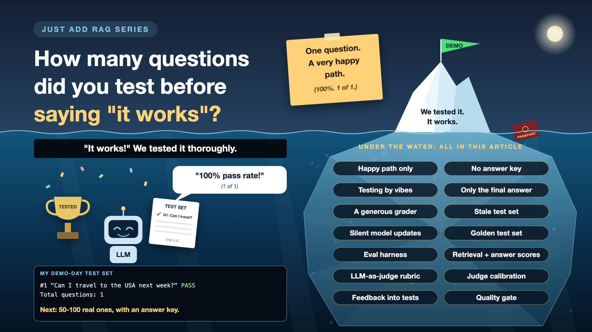

# 8. How Many Questions Did You Test Before Saying "It Works"?

*Just add RAG series: Evals and ground truth*

"We tested it. It works."

The most comforting sentence in an AI project. Also the one most worth a polite follow-up: how many questions did you test?

My honest answer, on demo day, was one. "Can I travel to the USA next week?" It passed. A 100% pass rate. One out of one. It was, admittedly, a very happy path.

Testing an AI system properly is called running evals. Every write-up in this series so far has ended with a small test. This is where they all come together.

*New to terms like eval harness or LLM-as-judge? Cheat sheet at the end.*

## Why evals deserve a budget

- **AI answers vary.** The same question can get different wording, and sometimes a different answer. One good run proves very little.
- **Every fix can break something else.** A new chunk size helps contracts and quietly hurts passports. Without a test set, nobody notices.
- **Models change under you.** Vendors update and retire models. Your prompt didn't change; the answers did.
- **Leaders need a number.** "It felt good in the demo" isn't a go-live criterion. "92 of 100 test questions correct, zero leaks" is.

## From one question to a real test set

Looking back at this series, my one question should have been at least five kinds:

- **Answerable:** "When does my passport expire?" (Expected: 29/09/2024.)
- **Needs reasoning:** "Can I travel next week?" (Expected: no, it's expired.)
- **Unanswerable:** "Do I need a visa?" (Expected: not in your documents.)
- **Needs a database:** "Which documents expire this year?" (Expected: routed to SQL.)
- **Other language:** the same questions, asked in Hindi.

Plus a few that should never work, like the intern asking for someone else's documents.

## Seven ways testing goes wrong

- **Only the happy path.** Ten easy questions from the build team. *Fix: 50-100 real questions, including hard, unanswerable and other-language ones.*
- **No answer key.** Someone eyeballs the answers and says "looks fine". *Fix: domain experts write the correct answer for each question, in advance.*
- **Testing by vibes.** Opening the chat and trying a few things before each release. *Fix: an automated test run that produces a score every time.*
- **Only checking the final answer.** A wrong answer could be a search miss or a model mistake. *Fix: score retrieval and the answer separately.*
- **A generous grader.** An LLM marks the answers and passes nearly everything. *Fix: check the grader against human marks on a sample first.*
- **A stale test set.** The documents changed, the answer key didn't. *Fix: update the answer key whenever the documents change.*
- **Silent model updates.** The vendor upgraded the model; nobody re-ran anything. *Fix: pin the model version, and re-run the tests before switching.*

## The eval toolkit, in plain words

1. **An exam paper with an answer key**

   A fixed list of real questions, each with its correct answer and the chunk it should come from. That's a **golden test set**, built on **ground truth**.
2. **The same exam, every time something changes**

   A script runs every question through the system and scores the results automatically. That's an **eval harness**, used for **regression testing**.
3. **Mark the working, not just the result**

   Did search find the right chunk? Was the answer correct and supported? Scored separately. That's **retrieval and generation metrics**.
4. **A teacher marking with a rubric**

   Another LLM grades each answer against clear criteria, because humans can't read 100 answers per change. That's **LLM-as-judge**.
5. **Check the teacher**

   Humans mark a sample too, and you compare. If the judge disagrees often, fix the judge first. That's **judge calibration**.
6. **Every real mistake joins the exam**

   Wrong answers reported by users are added to the test set, so they never come back. That's a **feedback loop**.
7. **No pass, no ship**

   A release waits until the score is at least as good as last time. That's a **quality gate**.

## How it works in practice

- The test set lives in a simple table: question, type, expected chunk, expected answer.
- The harness runs on every change: prompt, chunking, embedding model, LLM version, even temperature.
- Each run produces a scorecard: retrieval hit rate, correct answers, correct refusals, leaks. Compared with the previous run.
- If anything drops beyond an agreed margin, the change doesn't ship.

**Domain experts** write and maintain the answer key. Their time belongs in the project plan, not squeezed between meetings. **Engineers** build the harness. **Product** sets the pass bar. Someone reads user feedback every week and turns failures into new test questions.

## Cheat sheet: the words you'll hear, with examples

New in this write-up, plus two refreshers.

- **Eval (refresher):** a repeatable test against known answers. *50 questions, scored every release.*
- **Ground truth (refresher):** the answer key. *"When does my passport expire?": 29/09/2024.*
- **Happy path:** the easy case everything is designed for. *My one demo question.*
- **Edge case:** an unusual case that tends to break things. *The same question, asked in Hindi.*
- **Golden test set:** the agreed list of test questions with answers. *Answerable, unanswerable, database and Hindi questions.*
- **Eval harness:** the script that runs the test set and scores it. *Runs on every prompt or model change.*
- **Regression:** something that used to work and now doesn't. *New chunk size breaks the passport answer.*
- **LLM-as-judge:** using an LLM to grade answers. *"Does this answer match the expected one?"*
- **Rubric:** the marking criteria a judge uses. *Correct date, cites the passport, no extra claims.*
- **Judge calibration:** checking the LLM judge against human marks. *Humans and judge agree on 19 of 20.*
- **Pass rate:** the share of test questions answered correctly. *92 of 100.*
- **Quality gate:** a rule that blocks a release if scores drop. *No deploy below last week's score.*
- **Model pinning:** fixing the exact model version you use. *gpt-4o-mini, a specific dated version, not "latest".*

## Take this to your next kickoff meeting

1. Ask how many questions were tested, and who wrote the correct answers.
2. Budget domain experts' time for the answer key, like any other project resource.
3. Make the eval run a gate: no passing score, no release.

A demo proves it can work. Evals prove it still does, every day.

Next write-up (9): **A few cents per question: so why is finance calling?** (Cost)

Follow me for the next one. And tell me: how many test questions does your AI project have? Be honest. One counts.

**Earlier in this series:**

- 0. [Why does "Just add RAG" sound like 2 weeks but take 6 months?](https://www.linkedin.com/pulse/why-does-just-add-rag-sound-like-2-weeks-take-6-months-arpit-jain-l4kkf/)
- 1. [Why can't your AI read a PDF that a 10-year-old can?](https://www.linkedin.com/pulse/why-cant-your-ai-read-pdf-10-year-old-can-arpit-jain-fimif/)
- 2. [What if the answer was in your docs, but you cut it in half?](https://www.linkedin.com/pulse/what-answer-your-docs-you-cut-half-arpit-jain-pczxf/)
- 3. [Is your AI hallucinating, or just looking in the wrong place?](https://www.linkedin.com/pulse/your-ai-hallucinating-just-looking-wrong-place-arpit-jain-byozf/)

---

**Post text to share the article:**

> "We tested it. It works."
>
> How many questions? On my demo day: one. 100% pass rate. One out of one.
>
> Write-up 8 in my #JustAddRAG series: building a real test set, who writes the answer key, grading with an LLM without letting it mark its own homework, and three things to take to your next kickoff meeting.
>
> How many test questions does your AI project have? One counts.

**Hashtags:** #AIEngineering #RAG #GenAI #EnterpriseAI #LLMEvals #JustAddRAG
