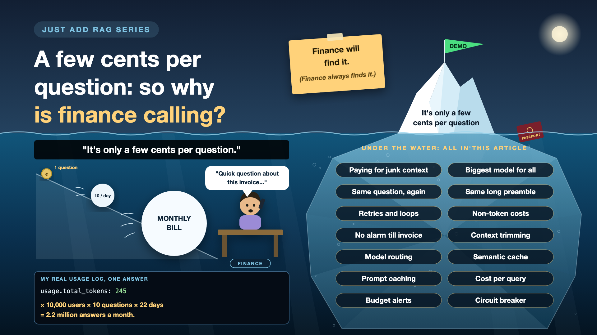

# 10. A Few Cents per Question: So Why Is Finance Calling?



*Just add RAG series: Cost*

"It's only a few cents per question."

True. That's exactly how it starts. Then the cents meet real usage: ten thousand users, ten questions a day, every working day, with longer documents, retries and a few extra model calls nobody counted. Finance will find it. Finance always finds it.

*New to terms like tokens or prompt caching? Cheat sheet at the end.*

## Why AI cost behaves differently

- **You pay per use, not per seat.** A licence costs the same whether people use it or not. An LLM bill grows with every question, every word sent and every word received.
- **The demo hides the multiplier.** Five people tried it ten times. Production is thousands of people, every day.
- **Hidden lines add up.** OCR per page, embeddings, the vector database, re-ranking, logs, and re-embedding everything when something changes.
- **Cost and speed travel together.** Long prompts and big models are both slower and more expensive. Fixing one usually helps the other.

## My 245 tokens

My passport answer from gpt-4o-mini used 245 tokens in total. I know because my code logged `usage.total_tokens` for every answer. Tiny.

But look at what made it tiny: one short passport, about a thousand characters. Swap in three long contract chunks, and the same question can cost many times more. And remember the tax return and salary slip from the retrieval write-up? Every junk chunk sent to the model is a chunk you pay for.

Now the multiplier. Even if one answer costs a fraction of a cent: 10,000 users × 10 questions a day × 22 working days = **2.2 million answers a month**. Small numbers, multiplied, stop being small.

## Seven ways the bill grows quietly

- **Paying for junk context.** Irrelevant chunks still cost money. *Fix: a minimum relevance score, and fewer, better chunks.*
- **The biggest model for everything.** "When does my passport expire?" doesn't need the most expensive model. *Fix: send easy questions to a smaller model.*
- **Answering the same question again and again.** Hundreds of people ask "what's the leave policy?" *Fix: reuse answers to common questions.*
- **The same long preamble, every time.** The system prompt and fixed instructions are re-sent with every question. *Fix: trim them, and cache the fixed part.*
- **Retries and loops.** A timeout triggers a retry, which triggers another. *Fix: cap retries, and set a cost limit per request.*
- **Forgetting the non-token costs.** OCR per page, embeddings, vector storage, re-embedding after changes. *Fix: model the whole bill, not just the LLM line.*
- **No alarm until the invoice.** *Fix: a monthly budget with alerts at, say, 50% and 80%.*

## The cost toolkit, in plain words

1. **Pack only what you need**

   Send the model the few chunks that matter, not everything that vaguely matched. That's **context trimming**, often with a **token budget**.
2. **Right-size the model**

   Easy questions go to a small, cheap model; hard ones to a bigger one. That's **model routing**.
3. **Remember the common answers**

   If a very similar question was answered recently, reuse that answer. That's a **semantic cache**.
4. **Don't pay full price for the same preamble**

   The fixed part of every prompt is stored by the provider and charged at a discount on repeat. That's **prompt caching**. I tried it in a small demo of its own.
5. **A taxi meter on every question**

   Log the tokens and cost of every answer, like my 245. That's **cost-per-query tracking**.
6. **A spending limit with alarms**

   A monthly budget that warns early and can throttle usage. That's **budget alerts**.
7. **Stop runaway loops**

   Cap retries and steps, and cut off any request that costs too much. That's a **circuit breaker**.

## How to estimate it before go-live

One line of maths, done honestly:

> Cost per question × questions per user per day × users × working days

Then add the rest: OCR for the first big load, embeddings, re-ranking, the vector database, logging, and a re-embedding budget for the day you change models.

**Product and finance** agree a budget and a target cost per question. **Engineers** add the meter and the limits. The **project owner** reviews cost per active user every month, before finance does.

## Cheat sheet: the words you'll hear, with examples

- **Token (refresher):** the unit models count and charge in. *My passport answer: 245 tokens.*
- **Input and output tokens:** what you send in, and what the model writes back. Usually priced differently. *Passport text in, one-paragraph answer out.*
- **Price per million tokens:** how most providers quote LLM prices. *Check your provider's current page; prices change.*
- **Cost per query:** the full cost of answering one question. *LLM plus embeddings plus search.*
- **Token budget:** a cap on how much context goes into a prompt. *At most 3 chunks.*
- **Context trimming:** removing low-value text before it's sent. *The salary slip stays out.*
- **Model routing:** picking a cheaper or stronger model per question. *Expiry date: small model.*
- **Semantic cache:** reusing answers to very similar questions. *"Leave policy?" answered once, served many times.*
- **Prompt caching:** a provider discount for re-sending the same prompt prefix. *The same system prompt on every question.*
- **Budget alert:** a warning when spending crosses a threshold. *Email at 50% and 80% of the monthly budget.*
- **Circuit breaker:** an automatic stop for runaway requests. *No more than 2 retries.*
- **Unit economics:** what one unit of usage costs and earns. *Cost per active user per month.*

## Take this to your next kickoff meeting

1. Ask for cost per question, not the cost of the demo month.
2. Multiply by real usage before go-live: users × questions × days.
3. Set budget alerts and request limits on day one.

AI bills don't arrive as one big number. They arrive as millions of small ones.

Next write-up (11): **It's fast in the demo, so why are users clicking twice?** (Performance and availability)

Follow me for the next one. And tell me: what was the most surprising line on your first AI invoice?

**Earlier in this series:**

1. [Why does "Just add RAG" sound like 2 weeks but take 6 months?](https://www.linkedin.com/pulse/why-does-just-add-rag-sound-like-2-weeks-take-6-months-arpit-jain-l4kkf/)
2. [Why can't your AI read a PDF that a 10-year-old can?](https://www.linkedin.com/pulse/why-cant-your-ai-read-pdf-10-year-old-can-arpit-jain-fimif/)
3. [What if the answer was in your docs, but you cut it in half?](https://www.linkedin.com/pulse/what-answer-your-docs-you-cut-half-arpit-jain-pczxf/)
4. [Is your AI hallucinating, or just looking in the wrong place?](https://www.linkedin.com/pulse/your-ai-hallucinating-just-looking-wrong-place-arpit-jain-byozf/)
5. [What does your AI say when it doesn't know?](https://www.linkedin.com/pulse/5-what-does-your-ai-say-when-doesnt-know-arpit-jain-wr5bf)

---

**Post text (copy and paste):**

```
"It's only a few cents per question."

My passport answer used 245 tokens. Tiny. Now multiply: 10,000 users × 10 questions × 22 days = 2.2 million answers a month.

Ignore cost until the invoice, and you pay for it, literally:
• Budget: junk context, retries and the biggest model for every question add up fast
• Latency: the same long prompts that cost more also answer slower
• Availability: no spending limit means one runaway loop can burn the month's budget
• Trust: finance discovers the bill before you do

Write-up 10 in my #JustAddRAG series: the seven ways an AI bill grows quietly, how to estimate it before go-live, and three things to take to your next kickoff meeting.

What was the most surprising line on your first AI invoice?

#AIEngineering #RAG #GenAI #EnterpriseAI #FinOps #JustAddRAG
```
