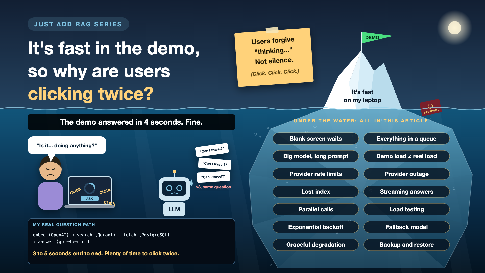

# It's Fast in the Demo, So Why Are Users Clicking Twice?

*Just add RAG series: Performance and availability*

My passport assistant answered in 3 to 5 seconds, end to end. In a demo, that's fine. Everyone watches the screen politely, someone makes a joke, the answer appears, applause.

In real use, two seconds of nothing feels broken. So people click "Ask" again. And again. Now the system is answering the same question three times, which makes it slower and costs triple. Nothing got fixed, except the user's opinion of AI.

*New to terms like p95 latency or graceful degradation? Cheat sheet at the end.*

## Why speed and uptime deserve a plan

- **Waiting feels like failure.** Users judge AI by how it feels, not by what it does behind the scenes.
- **The demo had one user.** Production has hundreds at once, all hitting the same services.
- **Every answer depends on several outside services.** If any one is slow or down, the whole answer is.
- **Some failures take days to fix.** Lose the search index without a backup, and you're re-processing every document from scratch.

## Four hops per question

Every question in my assistant made four trips, one after another:

1. Turn the question into numbers (OpenAI's embedding model).
2. Search for similar chunks (Qdrant).
3. Fetch the full text (PostgreSQL).
4. Write the answer (gpt-4o-mini).

Total: 3 to 5 seconds. Four places to wait. Four places to fail. And that's before re-ranking, guardrails or a second model call.

## Seven ways it gets slow, or stops

- **A blank screen while it thinks.** *Fix: stream the answer word by word, and show progress like "Searching your documents...".*
- **Everything in a queue.** Steps that could run together wait for each other. *Fix: run independent steps in parallel.*
- **A big model and a long prompt.** Both add seconds. *Fix: trim the context and right-size the model, the same fixes that cut cost.*
- **Demo load isn't real load.** One user is easy. Three hundred at 9:30 on Monday morning isn't. *Fix: load test with realistic numbers before launch.*
- **The provider says "slow down".** Every API has rate limits, and busy days hit them. *Fix: retry politely with growing pauses, and queue the overflow.*
- **The provider is down.** It happens to every provider eventually. *Fix: a fallback model, and a plan for what users see.*
- **The index is gone.** A bad deployment or a deleted volume. *Fix: regular backups of the vector index, and a restore you've actually tested.*

## The speed-and-uptime toolkit, in plain words

1. **Show the first words fast**

   The answer appears as it's written, so users see progress within a second or two. That's **streaming**, measured as **time to first token**.
2. **Do the chores at the same time**

   Independent steps run together instead of in a line. That's **parallel calls**.
3. **A practice crowd before the real one**

   Simulate hundreds of users at once, and see what breaks first. That's **load testing**.
4. **Knock again, but politely**

   After a failure, wait a little, then a little longer, before retrying. That's **exponential backoff**.
5. **A spare tyre**

   If the main model is down or slow, switch to another. That's a **fallback model**.
6. **When the kitchen's closed, still serve bread**

   If the AI can't answer, show the matching documents, or a clear "try again in a minute". That's **graceful degradation**.
7. **A copy of the library**

   The vector index is backed up, and someone has practised restoring it. That's **backup and restore**.

## How it works in practice

Agree the targets first, in plain language: how soon the first words should appear, and how long a full answer may take. Then measure each hop separately: embedding, search, database, LLM. Look at the slow end, not the average. The average hides the users who gave up.

**Product** sets how long users should wait. **Engineers** measure each hop and fix the slowest. **Operations** own monitoring, on-call, backups and the restore drill.

## How do you know it works?

Run a load test with realistic traffic. Unplug the LLM provider on purpose in a test environment and see what users get. And restore the index from backup once, before you ever need to.

## Cheat sheet: the words you'll hear, with examples

- **Latency:** how long something takes. *My full answer: 3 to 5 seconds.*
- **Time to first token:** how soon the first word of the answer appears. *Under two seconds feels responsive.*
- **Streaming:** showing the answer as it's generated. *"Your passport expired..." appearing word by word.*
- **p95 latency:** the time 95% of requests finish within. *Average 3 seconds can hide a p95 of 9.*
- **Throughput:** how many requests the system handles per second. *Questions per second at Monday 9:30.*
- **Concurrency:** how many requests are in progress at once. *300 users asking together.*
- **Load test:** simulating real traffic before launch. *300 fake users, 10 questions each.*
- **Rate limit:** a provider's cap on requests per minute. *"Too many requests, slow down."*
- **Exponential backoff:** retrying after waits that grow each time. *1 second, then 2, then 4.*
- **Fallback model:** a backup model used when the main one fails. *If gpt-4o-mini is down, use another.*
- **Graceful degradation:** a useful reduced service instead of an error. *Show my passport document instead of an answer.*
- **Backup and restore:** saving a copy of the index, and proving you can bring it back. *A Qdrant snapshot, restored once a quarter.*

## Take this to your next kickoff meeting

1. Agree how long users should wait, and measure the slow end, not the average.
2. Load test with realistic numbers of people asking at the same time.
3. Decide what users see when the AI provider is down, and test restoring the index.

Users forgive "thinking...". They don't forgive silence.

Next write-up: **Where did your user's passport just travel to?** (Privacy and compliance)

Follow me for the next one. And tell me: what's the longest an AI tool made you wait before you gave up?

**Earlier in this series:**

- [Why does "Just add RAG" sound like 2 weeks but take 6 months?](https://www.linkedin.com/pulse/why-does-just-add-rag-sound-like-2-weeks-take-6-months-arpit-jain-l4kkf/)
- [Why can't your AI read a PDF that a 10-year-old can?](https://www.linkedin.com/pulse/why-cant-your-ai-read-pdf-10-year-old-can-arpit-jain-fimif/)

---

**Post text to share the article:**

> My RAG demo answered in 3 to 5 seconds. Everyone waited politely.
>
> Real users wait two seconds, then click again. Now it's answering the same question three times.
>
> New write-up in my #JustAddRAG series: four hops per question, what happens when the AI provider is down, why the average hides your angriest users, and three things to take to your next kickoff meeting.
>
> What's the longest an AI tool made you wait before you gave up?

**Hashtags:** #AIEngineering #RAG #GenAI #EnterpriseAI #SRE #JustAddRAG
