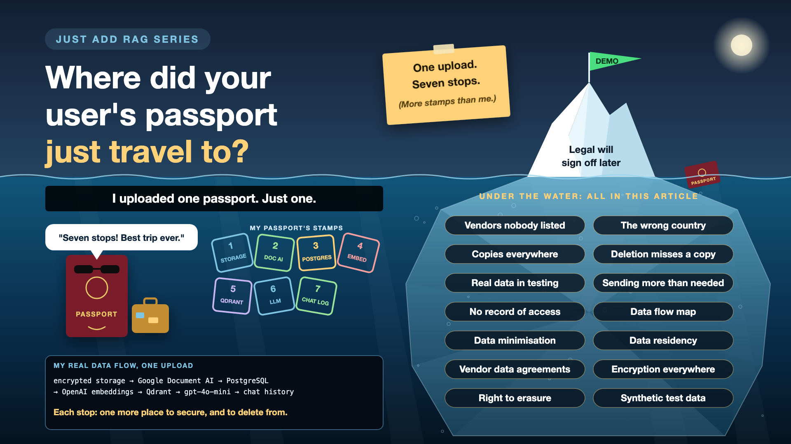

# 12. Where Did Your User's Passport Just Travel To?

*Just add RAG series: Privacy and compliance*

I uploaded one passport. Then I traced where it went:

1. **Encrypted file storage**, the original PDF.
2. **Google Document AI**, to read the scan.
3. **PostgreSQL**, the full extracted text.
4. **OpenAI**, to turn the text into an embedding.
5. **Qdrant**, the vector plus the file name.
6. **OpenAI again**, on every question, to write the answer.
7. **Chat history**, every answer that mentions the expiry date.

One upload. Seven stops. My passport has collected more stamps in my RAG system than in real life.

That's fine for my own documents. For a company holding customers' passports, salaries or medical records, every one of those stops is a question someone in legal will eventually ask.

*New to terms like data residency or DPA? Cheat sheet at the end.*

## Why privacy deserves a plan before launch

- **Every copy is a responsibility.** Seven places to secure, seven places to delete from.
- **Vendors are part of your system.** Where they store data, for how long, and whether it's used for training is set by their terms, not your code.
- **People have rights over their data.** Laws like the EU's GDPR and India's DPDP Act give people rights that include asking for their data to be deleted.
- **"Legal will sign off later" becomes "rebuild it later".** Changing where data flows after launch is far harder than deciding it before.

## Seven ways privacy goes wrong

- **Data travels to vendors nobody listed.** OCR, embeddings, the LLM, maybe a re-ranker. *Fix: an approved list of vendors, each with a signed data agreement.*
- **The wrong country.** Some data must stay in a region. Some APIs process it elsewhere by default. *Fix: pick regions and providers that keep data where it's allowed to be.*
- **Copies everywhere.** Full text in the database, vectors in the index, answers in chat history, prompts in logs. *Fix: keep only what you need, and know where every copy lives.*
- **Deletion that misses a copy.** The file is deleted; the vectors, logs and chat history aren't. *Fix: one delete workflow that reaches every store.*
- **Real personal data in testing.** Developers testing with real passports on their laptops. *Fix: realistic fake data for development and testing.*
- **Sending more than the task needs.** The full passport text goes to the LLM when only the expiry date matters. *Fix: mask or drop what the model doesn't need.*
- **No record of who saw what.** An auditor asks, and nobody can answer. *Fix: secure access logs, kept for an agreed period.*

## The privacy toolkit, in plain words

1. **Draw the map of the trip**

   A one-page picture of every place user data goes, vendors included, like my seven stops. That's a **data flow map**.
2. **Pack only what the trip needs**

   Send and store the minimum: mask numbers the model doesn't need. That's **data minimisation**.
3. **Keep it in the right country**

   Data stays in the regions the law and your customers allow. That's **data residency**.
4. **A signed promise from every vendor**

   Each provider agrees in writing how they store, use and delete your data, ideally with no long-term retention and no training on it. That's a **data processing agreement**.
5. **Lock every room**

   Data is encrypted while stored and while moving. My original files were stored encrypted from day one. That's **encryption at rest and in transit**.
6. **One button to forget someone**

   A single request deletes a person's data from every store. That's the **right to erasure**, built as a workflow.
7. **Practise with stand-ins**

   Realistic but fake passports, payslips and names for development and testing. That's **synthetic test data**.

## How it works in practice

Privacy is designed in, not checked at the end. Before building: draw the data flow map, choose vendors and regions, and agree retention periods. During building: mask early, encrypt everywhere, log access. Before launch: run the deletion test.

The **privacy or legal team** decides what's allowed. **Security** reviews vendors and storage. **Engineers** build the map into the system. **Data owners** decide how long things are kept.

## The deletion test

Create a test user. Upload a document. Ask a few questions. Then delete the user, and search every store: files, database, vector index, chat history, logs, caches. If anything is still there, the "delete" button is a polite suggestion.

## Cheat sheet: the words you'll hear, with examples

- **PII (refresher):** data that identifies a person. *Passport number, date of birth.*
- **Data flow map:** a diagram of every place data goes. *My seven stops.*
- **Data minimisation:** collecting and sharing only what's needed. *Send the expiry date, not the whole passport.*
- **Data residency:** where data is physically stored and processed. *Customer data kept inside India.*
- **Data processor:** a vendor that handles data on your behalf. *Google Document AI reading my scan.*
- **DPA (data processing agreement):** the contract setting how a processor handles your data. *Retention, region, no training.*
- **Data retention:** how long data is kept before deletion. *Chat history kept for 90 days, then removed.*
- **Encryption at rest and in transit:** scrambling data while stored and while moving. *My PDFs stored encrypted.*
- **Right to erasure:** a person's right to have their data deleted. *"Delete my passport, everywhere."*
- **Synthetic data:** realistic fake data for testing. *A made-up passport for a made-up person.*
- **Audit log:** a record of who accessed what, and when. *Who opened which document, at what time.*
- **DPIA (data protection impact assessment):** a structured privacy risk review before building. *Done before the first real passport is uploaded.*

## Take this to your next kickoff meeting

1. Ask for a one-page map of every place user data goes, vendors included.
2. Check each AI vendor's data terms: where it's stored, how long, and whether it's used for training.
3. Run the deletion test before launch.

Your AI's privacy is only as good as its most forgetful copy.

Next write-up (13): **When your AI gives a wrong answer, can you tell why?** (Observability)

Follow me for the next one. And tell me: could your team list every place your AI sends user data, right now, without checking?

**Earlier in this series:**

1. [Why does "Just add RAG" sound like 2 weeks but take 6 months?](https://www.linkedin.com/pulse/why-does-just-add-rag-sound-like-2-weeks-take-6-months-arpit-jain-l4kkf/)
2. [Why can't your AI read a PDF that a 10-year-old can?](https://www.linkedin.com/pulse/why-cant-your-ai-read-pdf-10-year-old-can-arpit-jain-fimif/)
3. [What if the answer was in your docs, but you cut it in half?](https://www.linkedin.com/pulse/what-answer-your-docs-you-cut-half-arpit-jain-pczxf/)
4. [Is your AI hallucinating, or just looking in the wrong place?](https://www.linkedin.com/pulse/your-ai-hallucinating-just-looking-wrong-place-arpit-jain-byozf/)
5. [What does your AI say when it doesn't know?](https://www.linkedin.com/pulse/5-what-does-your-ai-say-when-doesnt-know-arpit-jain-wr5bf)

---

**Post text to share the article:**

> I uploaded one passport to my RAG assistant, then traced where it went.
>
> Seven stops: storage, an OCR service, a database, an embedding API, a vector index, the LLM on every question, and chat history. My passport has more stamps in my RAG system than in real life.
>
> Leave privacy for "legal will sign off later", and you pay for it:
> • Compliance: personal data in vendors and regions nobody approved
> • Legal risk: a "delete" that misses the vectors, logs and chat history
> • Security: every extra copy is one more place to breach
> • Rework: changing data flows after launch costs far more than designing them first
>
> Write-up 12 in my #JustAddRAG series: data flow maps, vendors, residency, the deletion test, and three things to take to your next kickoff meeting.
>
> Could your team list every place your AI sends user data, without checking?

**Hashtags:** #AIEngineering #RAG #GenAI #EnterpriseAI #Privacy #JustAddRAG
