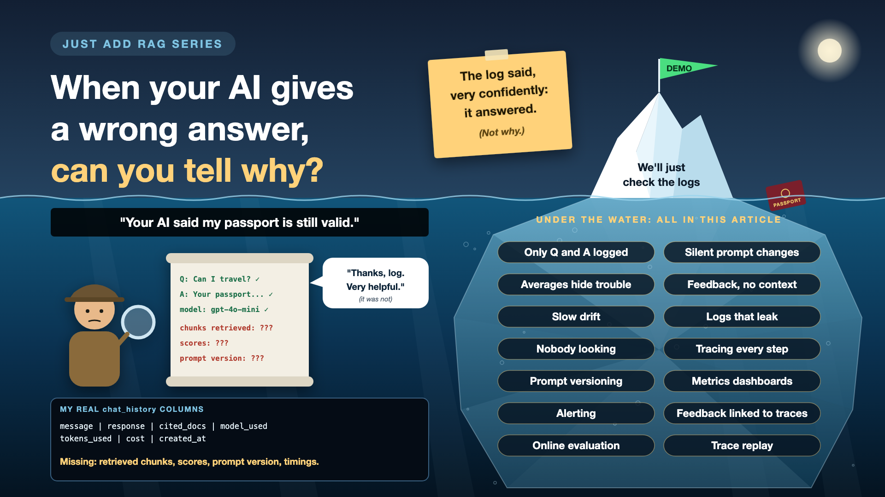

# When Your AI Gives a Wrong Answer, Can You Tell Why?

*Just add RAG series: Observability*

A user complains: "Your AI said my passport is still valid. It isn't."

Now what? Was it a bad scan? A chunk cut in half? The wrong document retrieved? A prompt change last Tuesday? A quiet model update? Each of these write-ups has been about one of those. When something goes wrong in production, you need to know which one, quickly.

The ability to answer "why did it say that?" from your own records is called observability. Without it, debugging AI is guesswork with extra steps.

*New to terms like trace or drift? Cheat sheet at the end.*

## Why AI needs more than ordinary logs

- **Wrong answers don't throw errors.** A confident wrong answer looks exactly like a right one to the server. No red alert, no stack trace.
- **Many layers, one symptom.** Ingestion, chunking, retrieval, prompt and model can all produce the same bad answer.
- **Things change without a release.** Documents change, models update, users ask new kinds of questions.
- **Feedback without context is a riddle.** A thumbs-down tells you something is wrong, not what.

## What my log kept, and what it missed

My assistant saved every exchange in a `chat_history` table in PostgreSQL: the question, the answer, the cited document, the model name, tokens used, cost and time. A decent audit trail, honestly.

But it didn't keep the chunks that were retrieved, their similarity scores, the exact prompt sent, the prompt version, or how long each step took. So if an answer had gone wrong, I could have seen *what* was said, not *why*. The log would have said, very confidently: it answered.

## Seven gaps that make debugging guesswork

- **Only the question and answer.** *Fix: record every step: what was retrieved, the scores, the prompt, the model, the settings.*
- **Prompts change silently.** Someone edits the prompt, nobody knows which answers used which version. *Fix: version prompts, and log the version with every answer.*
- **Averages hide trouble.** Average quality looks fine while one document type fails every time. *Fix: dashboards that break results down by document type, language and question type.*
- **Feedback with no context.** A thumbs-down arrives, detached from what happened. *Fix: link every piece of feedback to the full record of that answer.*
- **Slow drift.** Quality slides a little each week as documents and questions change. *Fix: regularly score a sample of live answers with your evals.*
- **Logs that leak.** Detailed records full of personal data. *Fix: mask personal data in logs, as in the privacy write-up.*
- **Lots of data, nobody looking.** *Fix: a few alerts that matter, and a weekly review with a named owner.*

## The observability toolkit, in plain words

1. **A flight recorder for every answer**

   Each question gets one ID, and every step it passes through is recorded under it, with timings. That's **tracing**.
2. **Note which recipe was used**

   Every prompt has a version number, logged with each answer. That's **prompt versioning**.
3. **A thermometer on the wall**

   A few numbers watched over time: speed, cost, refusals, thumbs-down rate. That's **metrics** on a **dashboard**.
4. **Ring the bell when it matters**

   A warning when a number crosses a line, not when someone happens to look. That's **alerting**.
5. **Connect the complaint to the recording**

   A thumbs-down opens the exact trace of that answer. That's **feedback linked to traces**.
6. **Spot-check live answers**

   Your eval checks run on a sample of real traffic, every day. That's **online evaluation**.
7. **Replay the exact moment**

   Run the same question, with the same chunks, prompt version and model, to reproduce the problem. That's **trace replay**.

## How it works in practice

Every question gets a trace ID at the door. Each hop logs what went in, what came out and how long it took: the embedding, the search results with scores, the database fetch, the final prompt, the model's answer, and any guardrail decisions. Personal data is masked before it's stored. Open standards like OpenTelemetry, and dedicated LLM observability tools, make this much easier than building it from scratch.

**Engineers** add the tracing. **Product** picks the handful of metrics that matter. **Support** routes feedback with its trace ID. A **named owner** reviews the dashboard every week.

## The five-minute test

Take one real wrong answer. Give the team five minutes and the logs, nothing else. Can they say which layer failed: reading, chunking, search, prompt or model? If not, you're not ready to run this at scale.

## Cheat sheet: the words you'll hear, with examples

- **Observability:** being able to explain what your system did, from its own records. *Why did it say my passport is valid?*
- **Log:** a written record of an event. *My `chat_history` row: question, answer, model, tokens.*
- **Trace:** the full record of one request, step by step. *Embed, search, fetch, prompt, answer, for one question.*
- **Span:** one step inside a trace, with its timing. *The Qdrant search took 120 ms.*
- **Trace ID:** the unique ID that ties all of a request's steps together. *Like my `chat-30f5e6b3`, carried through every hop.*
- **Metric:** a number tracked over time. *Refusal rate, cost per question, p95 latency.*
- **Dashboard:** a screen showing key metrics at a glance. *Quality, speed and cost, by document type.*
- **Alert:** an automatic warning when a metric crosses a threshold. *Thumbs-down rate doubles overnight.*
- **Prompt versioning:** numbering each change to a prompt. *Prompt v7 answered this; v8 is live now.*
- **Drift:** slow change in quality or inputs over time. *New question types nobody tested for.*
- **Online evaluation:** running eval checks on a sample of live traffic. *50 real answers scored every day.*
- **Audit trail (refresher):** a stored record of questions, answers and sources. *Mine: chat history in PostgreSQL.*

## Take this to your next kickoff meeting

1. Take one wrong answer and ask the team to explain it, using only the logs.
2. Log the retrieved chunks, scores, prompt version and model with every answer.
3. Connect every thumbs-down to its full trace.

You can't fix what you can't replay.

Next write-up: **What breaks when you change the model you never changed?** (Model changes)

Follow me for the next one. And tell me: the last time your AI was wrong, how long did it take to find out why?

**Earlier in this series:**

- [Why does "Just add RAG" sound like 2 weeks but take 6 months?](https://www.linkedin.com/pulse/why-does-just-add-rag-sound-like-2-weeks-take-6-months-arpit-jain-l4kkf/)
- [Why can't your AI read a PDF that a 10-year-old can?](https://www.linkedin.com/pulse/why-cant-your-ai-read-pdf-10-year-old-can-arpit-jain-fimif/)
- [What if the answer was in your docs, but you cut it in half?](https://www.linkedin.com/pulse/what-answer-your-docs-you-cut-half-arpit-jain-pczxf/)

---

**Post text to share the article:**

> "Your AI said my passport is still valid. It isn't."
>
> My log would have told me exactly what it said. Not why. The log said, very confidently: it answered.
>
> New write-up in my #JustAddRAG series: traces, prompt versions, linking feedback to the full story, the five-minute test, and three things to take to your next kickoff meeting.
>
> The last time your AI was wrong, how long did it take to find out why?

**Hashtags:** #AIEngineering #RAG #GenAI #EnterpriseAI #Observability #JustAddRAG
