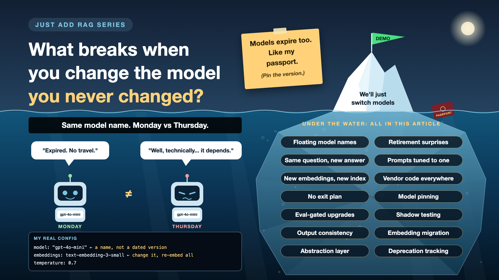

# 13. What Breaks When You Change the Model You Never Changed?

*Just add RAG series: Model changes and lock-in*

Nobody touched the code. Nobody touched the prompt. Nobody touched the documents. And yet, on Thursday, the answers are a little different from Monday.

Welcome to renting your brain. AI vendors improve, update and retire their models on their own schedule. The name on your config can stay the same while the model behind it changes.

And sometimes you'll want to change models yourself: a cheaper one, a better one, a different vendor. That's when you find out how deeply the old one is woven in.

*New to terms like model pinning or shadow testing? Cheat sheet at the end.*

## Why model changes deserve a plan

- **You rent the model, you don't own it.** The vendor decides when versions change and when old ones retire.
- **Small changes ripple.** A slightly different model can phrase things differently, refuse more or less, or format answers in new ways.
- **Embeddings are a special trap.** Change the embedding model, and every stored vector becomes incompatible. That's a full re-embed.
- **Better options keep appearing.** If switching takes six months, you'll keep paying more for less.

## What my config actually said

- **LLM:** `"gpt-4o-mini"`. A model name, not a specific dated version. Whatever sits behind that name is what I get.
- **Temperature:** 0.7, so even the same model can word the same answer differently.
- **Embeddings:** `text-embedding-3-small`, 1,536 numbers per chunk. Every vector in Qdrant depends on it. Switch it, and the whole index must be rebuilt.
- **Prompts:** kept in a `prompts.py` file under version control. A good habit.
- **Model calls:** made directly through OpenAI's SDK inside my core service code. Switching providers would mean editing the heart of the app.

Models have expiry dates too. Just like my passport.

## Seven ways model changes bite

- **Floating model names.** The name stays, the model underneath changes. *Fix: pin exact versions, and upgrade on purpose.*
- **Retirement surprises.** An email nobody read announced the old model's end date. *Fix: track vendor deprecation notices, with a named owner and a calendar.*
- **Different answers, same question.** *Fix: low temperature for factual work, and structured output where possible.*
- **Prompts tuned to one model.** The new model reads the same prompt differently. *Fix: re-run the eval harness for every model change, before switching.*
- **Embedding swaps break the index.** Vectors from two different models can't be compared. *Fix: build a new index alongside the old one, compare, then switch.*
- **Vendor code everywhere.** SDK calls scattered across the app. *Fix: one thin layer that every model call goes through.*
- **No exit plan.** One vendor, no tested alternative. *Fix: keep a second model tested and ready.*

## The model-change toolkit, in plain words

1. **Write the exact version on the label**

   Use a specific, dated model version, not a general name. That's **model pinning**.
2. **A test drive before you swap cars**

   Every candidate model runs your full test set before it's allowed near users. That's an **eval-gated upgrade**.
3. **The new driver rides along quietly**

   The new model answers real questions in the background, without users seeing it, and you compare. That's **shadow testing**.
4. **Same question, same answer**

   Low temperature and a fixed answer format make results more repeatable. That's **output consistency**.
5. **Move house one room at a time**

   A new embedding model gets its own fresh index, built alongside the old one; you switch only when it scores better. That's an **embedding migration**.
6. **One plug, many sockets**

   All model calls go through one small layer, so changing vendors is a config change. That's an **abstraction layer**.
7. **Know the expiry date**

   Someone tracks when each model version will be retired, just like a passport. That's **deprecation tracking**.

## How an upgrade works in practice

1. A new model version appears, or an old one is being retired.
2. Run the eval harness against it. Compare scores, cost and speed.
3. Shadow test it on real traffic for a while.
4. Switch, with a one-click way back.
5. For embeddings: re-embed into a new index in parallel, compare retrieval hit rates, switch, then delete the old one.

**Engineers** own the model list and migrations. **Product** approves any visible behaviour change. **Procurement and legal** handle vendor terms. A **named owner** reads the deprecation emails, and puts the dates in a calendar.

## Cheat sheet: the words you'll hear, with examples

- **Model alias:** a general model name that can point to different versions over time. *Mine: "gpt-4o-mini".*
- **Model version:** one specific, fixed release of a model, usually with a date in its name. *A dated gpt-4o-mini snapshot.*
- **Model pinning (refresher):** always calling a specific version. *No surprise Thursday upgrades.*
- **Deprecation:** a vendor announcing a model will be retired. *"This version stops working on a set date."*
- **Temperature (refresher):** how much variety the model adds. *Mine: 0.7. Lower for facts.*
- **Structured output:** asking the model to answer in a fixed format. *{expired: true, expiry_date: "29/09/2024"}.*
- **Shadow testing:** running a new model on real traffic without showing users its answers. *A week of side-by-side comparison.*
- **A/B test:** showing two versions to different users and comparing results. *Half the users get the new model.*
- **Rollback:** switching back to the previous version quickly. *One config change, not a redeploy.*
- **Embedding migration:** moving to a new embedding model by rebuilding the index. *A new index next to the old one in Qdrant.*
- **Abstraction layer:** one piece of code every model call goes through. *Change vendors in one place.*
- **Vendor lock-in:** being stuck with a supplier because leaving is too costly. *OpenAI SDK calls all over the code.*

## Take this to your next kickoff meeting

1. Ask which exact model versions are in production, and who reads the deprecation emails.
2. Make every model change pass the eval harness first.
3. Keep model calls behind one thin layer, so switching is a config change, not a rewrite.

You can rent the brain. Just don't let it move in.

Next write-up (14): **The demo works, so why isn't it 4 weeks from production?** (Estimates)

Follow me for the next one. And tell me: has a model update ever changed your AI's answers without warning?

**Earlier in this series:**

0. [Why does "Just add RAG" sound like 2 weeks but take 6 months?](https://www.linkedin.com/pulse/why-does-just-add-rag-sound-like-2-weeks-take-6-months-arpit-jain-l4kkf/)
1. [Why can't your AI read a PDF that a 10-year-old can?](https://www.linkedin.com/pulse/why-cant-your-ai-read-pdf-10-year-old-can-arpit-jain-fimif/)
2. [What if the answer was in your docs, but you cut it in half?](https://www.linkedin.com/pulse/what-answer-your-docs-you-cut-half-arpit-jain-pczxf/)
3. [Is your AI hallucinating, or just looking in the wrong place?](https://www.linkedin.com/pulse/your-ai-hallucinating-just-looking-wrong-place-arpit-jain-byozf/)

---

**Post text to share the article:**

> Nobody touches the code. Nobody touches the prompt. And the answers can still change.
>
> My config said "gpt-4o-mini": a name, not a version. Models have expiry dates too. Just like my passport.
>
> Write-up 13 in my #JustAddRAG series: model pinning, embedding migrations, testing a new model before users meet it, avoiding vendor lock-in, and three things to take to your next kickoff meeting.
>
> Has a model update ever changed your AI's answers without warning?

**Hashtags:** #AIEngineering #RAG #GenAI #EnterpriseAI #LLMOps #JustAddRAG
