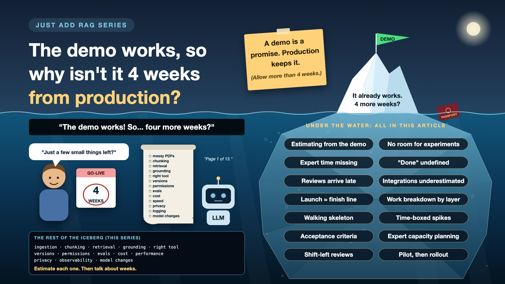

# 14. The Demo Works, So Why Isn't It 4 Weeks From Production?

*Just add RAG series: Estimates and expert time*

The demo works. Everyone's impressed. Then the question: "So it's basically done? Four more weeks?"

It's an honest question. The demo really does work. But a demo proves the idea, not the system. It works on clean documents, one user, friendly questions, and nobody's personal data.

The rest is everything in this series so far: messy documents, chunking, retrieval, grounding, the right tool, versions, permissions, evals, cost, speed, privacy, observability and model changes. Thirteen write-ups' worth of "one more thing".

*New to terms like walking skeleton or spike? Cheat sheet at the end.*

## Why AI estimates go wrong

- **The demo is the easy part.** It's the tip of the iceberg, and it's what everyone sees.
- **AI work is partly experimental.** You don't know if a chunking or retrieval approach works until you test it. Some experiments fail. That's normal, not a delay.
- **"Good enough" is often undefined.** Without an agreed quality bar, the finish line keeps moving.
- **The scarcest resource isn't engineers.** It's the domain experts who know the right answers, and their calendars.

## My demo, and everything after it

My passport demo came together quickly. The steps were clear, the tools worked, and the answer was right. Turning it into something I'd trust with other people's passports is a different job entirely. Every write-up in this series is one slice of that job.

## Seven estimation traps

- **Estimating from the demo.** "It works, so it's nearly done." *Fix: estimate every layer of the iceberg, not the tip.*
- **No room for experiments.** The plan assumes the first chunking idea works. *Fix: time-box experiments, and plan for a few dead ends.*
- **Expert time is missing.** Someone has to write test questions and check answers. *Fix: put domain experts' hours in the plan, with their manager's agreement.*
- **"Done" is undefined.** *Fix: agree the quality bar upfront, as eval targets: accuracy, refusals, zero leaks.*
- **Reviews arrive late.** Security, privacy and legal see it two weeks before launch. *Fix: invite them to the kickoff.*
- **Integrations underestimated.** Single sign-on, permission sync, source systems, ticketing. *Fix: list every system it must connect to, and estimate each.*
- **Launch treated as the finish line.** *Fix: budget for running it: monitoring, re-indexing, model updates, and a named owner.*

## The estimation toolkit, in plain words

1. **Count the iceberg, not the tip**

   Break the work down by layer: ingestion, chunking, retrieval, grounding, security, evals, and so on. That's a **work breakdown**.
2. **Build a thin road end to end first**

   A basic version of every layer, including logging and tests, before polishing any one of them. That's a **walking skeleton**.
3. **A fixed-length experiment**

   "We'll try semantic chunking for three days, then decide." That's a **time-boxed spike**.
4. **Agree what "good" means before starting**

   Clear, measurable targets, written down. That's **acceptance criteria**.
5. **Book the experts like a meeting room**

   Domain experts' time reserved in advance, not borrowed. That's **expert capacity planning**.
6. **Invite the reviewers early**

   Security, privacy and legal at the kickoff, not the finish. That's **shift-left review**.
7. **A few users before everyone**

   Launch to a small group, learn, fix, then widen. That's a **pilot**, then a **phased rollout**.

## A phased plan that tends to survive reality

1. **Discovery:** look at 50 real documents, write 50 real test questions, agree the quality bar.
2. **Walking skeleton:** every layer working end to end, basic but measured.
3. **Improve with evals:** fix the weakest layer first, as the scores show.
4. **Pilot:** real users, real feedback, close monitoring.
5. **Scale:** wider rollout, with an owner and a running budget.

Each phase ends with a decision, based on numbers, not on how the demo felt.

The **sponsor** approves each phase. **Product** owns the quality bar. **Engineers** estimate layer by layer. **Domain experts** commit their hours. **Security and legal** review from the start.

## Cheat sheet: the words you'll hear, with examples

- **Estimate:** a forecast of effort and time, with its uncertainty. *"10-14 weeks, depending on how messy the scans are."*
- **Work breakdown:** splitting a project into estimable pieces. *One line per layer of the iceberg.*
- **Walking skeleton:** a thin, working version of the whole system. *Upload, search, answer, log, test: all basic, all connected.*
- **Spike:** a short experiment to answer one question. *"Does semantic chunking beat recursive on our contracts?"*
- **Time-box:** a fixed limit on how long something may take. *Three days, then decide.*
- **Acceptance criteria:** measurable conditions for "done". *90% correct answers, 100% correct refusals, zero leaks.*
- **Definition of done:** the checklist every piece of work must pass. *Tested, logged, reviewed, documented.*
- **SME (subject matter expert):** the person who knows the right answers. *HR for HR policies.*
- **Shift-left review:** involving reviewers early instead of at the end. *Security at the kickoff.*
- **Pilot:** a limited launch to a small group. *One department, four weeks.*
- **Phased rollout:** widening access in stages. *One team, then one region, then everyone.*
- **Run cost:** what it costs to operate after launch. *Tokens, hosting, monitoring, people.*

## Take this to your next kickoff meeting

1. Estimate the iceberg, not the demo: list every layer, and estimate each one.
2. Agree the quality bar and the experts' time before the first sprint.
3. Plan a pilot before a full launch, and a budget for running it after.

A demo is a promise. Production is keeping it.

Next write-up (15): **You built it. Why isn't anyone using it?** (Adoption and ROI)

Follow me for the next one. And tell me: what's the biggest gap you've seen between a demo date and a go-live date?

**Earlier in this series:**

0. [Why does "Just add RAG" sound like 2 weeks but take 6 months?](https://www.linkedin.com/pulse/why-does-just-add-rag-sound-like-2-weeks-take-6-months-arpit-jain-l4kkf/)
1. [Why can't your AI read a PDF that a 10-year-old can?](https://www.linkedin.com/pulse/why-cant-your-ai-read-pdf-10-year-old-can-arpit-jain-fimif/)
2. [What if the answer was in your docs, but you cut it in half?](https://www.linkedin.com/pulse/what-answer-your-docs-you-cut-half-arpit-jain-pczxf/)
3. [Is your AI hallucinating, or just looking in the wrong place?](https://www.linkedin.com/pulse/your-ai-hallucinating-just-looking-wrong-place-arpit-jain-byozf/)

---

**Post text to share the article:**

> "The demo works! So... four more weeks?"
>
> A demo proves the idea, not the system. The rest is the whole iceberg: documents, search, grounding, permissions, evals, cost, speed, privacy, monitoring.
>
> Write-up 14 in my #JustAddRAG series: seven estimation traps, a phased plan that tends to survive reality, and three things to take to your next kickoff meeting.
>
> What's the biggest gap you've seen between a demo date and a go-live date?

**Hashtags:** #AIEngineering #RAG #GenAI #EnterpriseAI #AILeadership #JustAddRAG
