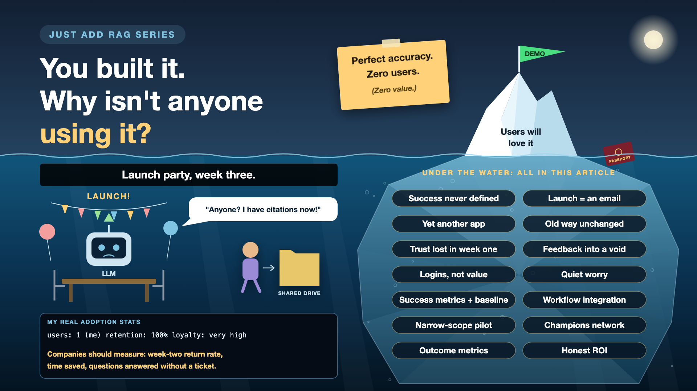

# 15. You Built It. Why Isn't Anyone Using It?

*Just add RAG series: Adoption and ROI*

Picture launch day. The announcement email goes out. Hundreds of people log in, try a question or two, and say "nice". Three weeks later, a loyal handful is still using it. Everyone else has quietly gone back to the shared drive and asking a colleague.

The AI works. The project still failed.

My own passport assistant has exactly one user, me, and an adoption rate of 100%. I'm very loyal. Companies don't get that luxury.

*New to terms like retention or vanity metric? Cheat sheet at the end.*

## Why adoption decides the value

- **An unused AI has zero return.** Accuracy, speed and cost don't matter if nobody asks it anything.
- **Trust is won or lost in week one.** One confident wrong answer early on, and people don't come back to check if it improved.
- **The old way is always easier.** People already know how to search the drive or ping a colleague. The new tool has to be clearly better.
- **Leaders will ask for the return.** If success was never defined, there's nothing to show them except login counts.

## Eight ways adoption fails

- **Success never defined.** Nobody wrote down what "worth it" means. *Fix: two or three business measures, with a baseline, before launch.*
- **Launch means an email.** *Fix: show people how it fits their actual work, in short sessions, in their own team.*
- **It lives somewhere new.** Another tab, another login, another app. *Fix: put it where people already work: the intranet, the chat tool, the ticket form.*
- **The old way still exists, unchanged.** *Fix: redesign the process around the new tool, not next to it.*
- **Trust lost in week one.** It launched broad and wobbly. *Fix: start with a narrow topic where it's reliably right, then expand.*
- **Feedback goes into a void.** People report wrong answers and hear nothing back. *Fix: close the loop visibly: "you reported it, we fixed it".*
- **Measuring logins, not value.** Lots of logins, little help. *Fix: track whether tasks got done faster, and whether people came back.*
- **Quiet worry.** "Is this here to replace me?" *Fix: explain the purpose honestly, and involve the people who'll use it in testing it.*

## The adoption toolkit, in plain words

1. **Write down what "worth it" means, first**

   Two or three numbers the business cares about, measured before launch too. That's **success metrics** against a **baseline**.
2. **Go where people already are**

   The AI shows up inside the tools people use every day. That's **workflow integration**.
3. **Start small and sure**

   One team, one topic, high accuracy, then grow. That's a **narrow-scope pilot**.
4. **A friendly guide in every team**

   One person per team who knows the tool well and helps colleagues. That's a **champions network**.
5. **Show the receipts**

   Every answer shows its source, so people learn to trust it by checking. That's **transparency**, from the grounding write-up.
6. **Close the loop, out loud**

   Tell people what was fixed because of their feedback. That's a **visible feedback loop**.
7. **Count value, not visits**

   Track repeat use and time saved, not just how many people logged in once. That's **outcome metrics**, not **vanity metrics**.
8. **Count the money honestly**

   Value created compared with the full cost of running it, from the cost write-up. That's **ROI**.

## How to measure value in practice

Before launch, measure today: how long it takes to find an answer, how many questions go to HR or IT, how often people get it wrong. After launch, track the same numbers, plus weekly active users and how many come back. Review monthly: value created against total running cost.

The **business sponsor** owns the outcome. **Product** owns adoption. **Change and comms** run onboarding. **Champions** help day to day. **Finance** checks the return.

## The week-two test

Of the people who tried it in week one, how many came back in week two, without being reminded? That single number says more about your AI than any demo.

## Cheat sheet: the words you'll hear, with examples

- **Adoption:** people actually using a tool as part of their work. *Asking the assistant instead of searching the drive.*
- **Active users (WAU):** how many people used it in a given week. *Weekly active users, not total sign-ups.*
- **Retention:** how many users keep coming back over time. *Week-one users still asking in week two.*
- **Baseline:** the "before" measurement you compare against. *Finding a policy answer takes 15 minutes today.*
- **KPI (key performance indicator):** a number that shows whether you're succeeding. *Time saved per question.*
- **Vanity metric:** a number that looks good but proves little. *Total logins on launch day.*
- **Outcome metric:** a number tied to real value. *HR questions answered without raising a ticket.*
- **Deflection rate:** the share of questions resolved without a human. *4 in 10 IT questions answered by the assistant.*
- **ROI (return on investment):** value created compared with cost. *Hours saved, compared with tokens, hosting and people.*
- **TCO (total cost of ownership):** the full cost of building and running it. *Not just the LLM bill.*
- **Change management:** helping people adopt a new way of working. *Training, champions, updated processes.*
- **Champion:** a go-to person who helps their team use the tool. *One per department.*

## Take this to your next kickoff meeting

1. Define how you'll know it's worth it, with a baseline, before launch.
2. Put the AI where people already work, and start with a narrow, reliable scope.
3. Track week-two return rate and real outcomes, not logins.

An AI nobody uses has perfect accuracy and zero value.

Next write-up (16): **So, should you really "just add RAG"?** (The checklist)

Follow me for the next one. And tell me: what made you actually keep using an AI tool at work, or quietly stop?

**Earlier in this series:**

0. [Why does "Just add RAG" sound like 2 weeks but take 6 months?](https://www.linkedin.com/pulse/why-does-just-add-rag-sound-like-2-weeks-take-6-months-arpit-jain-l4kkf/)
1. [Why can't your AI read a PDF that a 10-year-old can?](https://www.linkedin.com/pulse/why-cant-your-ai-read-pdf-10-year-old-can-arpit-jain-fimif/)
2. [What if the answer was in your docs, but you cut it in half?](https://www.linkedin.com/pulse/what-answer-your-docs-you-cut-half-arpit-jain-pczxf/)
3. [Is your AI hallucinating, or just looking in the wrong place?](https://www.linkedin.com/pulse/your-ai-hallucinating-just-looking-wrong-place-arpit-jain-byozf/)

---

**Post text to share the article:**

> Launch day: everyone logs in and says "nice". Three weeks later: a loyal handful.
>
> The AI works. The project still failed.
>
> Write-up 15 in my #JustAddRAG series: defining "worth it" before launch, putting AI where people already work, the week-two test, and three things to take to your next kickoff meeting.
>
> What made you keep using an AI tool at work, or quietly stop?

**Hashtags:** #AIEngineering #RAG #GenAI #EnterpriseAI #AIAdoption #JustAddRAG
