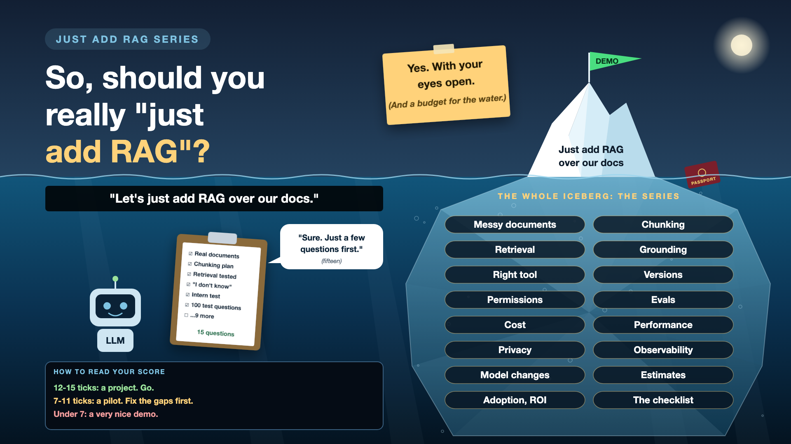

# 17. So, Should You Really "Just Add RAG"?

*Just add RAG series: The checklist*

After fifteen write-ups about everything that goes wrong, you might expect the answer to be "no".

It isn't. I still like RAG. My passport assistant answered the question correctly on day one, and that's real. The answer is yes, with your eyes open, a real plan, and a budget for what's under the water.

This last write-up puts the whole series on one page: when RAG fits, when it doesn't, and the checklist I'd now take into any kickoff meeting.

## When RAG is a good fit

- **The answers live in documents.** Policies, manuals, contracts, knowledge bases.
- **People ask in their own words.** Not keywords, not form fields.
- **The documents change.** RAG updates by re-indexing, not by retraining a model.
- **Sources matter.** People need to see where an answer came from.

## When something else fits better

- **Counting, totals and lists.** That's a database. (See the right-tool write-up.)
- **Live data.** That's an API call.
- **A fixed process.** That's a form or a workflow.
- **Ten FAQs.** That's a well-written FAQ page. Much cheaper, and it never hallucinates.

And often, the best answer is a mix: RAG for meaning, a database for numbers, and a human for the hard calls.

## The whole iceberg, in one checklist

One question for each piece of the iceberg. If the team has a clear answer, tick it.

- [ ] **Documents:** Has anyone opened 50 real documents, scans and tables included?
- [ ] **Chunking:** Which chunking strategy does each document type use, and why?
- [ ] **Retrieval:** What's the retrieval hit rate on real questions, in every language users speak?
- [ ] **Grounding:** What does the AI say when the answer isn't in the documents?
- [ ] **Right tool:** Which questions go to a database or an API instead of RAG?
- [ ] **Versions:** How does an old or deleted document leave the AI's memory?
- [ ] **Permissions:** Has the intern test passed, with permissions enforced in search?
- [ ] **Evals:** How many test questions are there, and who wrote the answers?
- [ ] **Cost:** What's the cost per question, multiplied by real usage?
- [ ] **Performance:** How long do users wait, and what do they see when the provider is down?
- [ ] **Privacy:** Is there a map of every place user data goes, and has the deletion test passed?
- [ ] **Observability:** Can the team explain a wrong answer from the logs in five minutes?
- [ ] **Model changes:** Which exact model versions are live, and who reads the deprecation emails?
- [ ] **Estimates:** Was every layer estimated, including expert time?
- [ ] **Adoption:** How will we know it's worth it, and what's the week-two return rate?

## How to read your score

- **12-15 ticks:** you have a project, not a demo. Go.
- **7-11 ticks:** a good pilot. Fix the gaps before you scale.
- **Fewer than 7:** you have a very nice demo. Treat the gaps as the real plan, and budget for them.

No shame in a low score on day one. Every question on that list was one I couldn't answer when my passport demo first worked.

## What I'd do differently, starting again

- **Week one:** open the real documents, write 30 real test questions, including unanswerable ones and a few in Hindi.
- **Before any code:** draw the data flow map, and agree what "good" means.
- **From day one:** pin model versions, log every step, filter every search by user, and set a minimum relevance score.
- **Before launch:** run the intern test, the deletion test, the five-minute test and the week-two test.

None of this is glamorous. All of it is what turns "just add RAG" into something people trust.

## Take this to your next kickoff meeting

1. Print the checklist, and score your project honestly.
2. Turn every unticked box into a line in the plan, with an owner and a budget.
3. Decide whether RAG is even the right tool, before deciding how to build it.

RAG isn't a feature you add. It's a data pipeline with an LLM at the end, and everything under the water is the job.

## Thank you

To everyone who read, commented, and shared their own stories of PDFs, chunks and confident wrong answers: thank you. Many of these write-ups got better because of your comments.

This series ends here. The next one starts soon, on another sentence that sounds simple in a kickoff meeting. Follow me if you'd like to catch it.

And tell me one last time: how many boxes did your project tick?

**Earlier in this series:**

1. [Why does "Just add RAG" sound like 2 weeks but take 6 months?](https://www.linkedin.com/pulse/why-does-just-add-rag-sound-like-2-weeks-take-6-months-arpit-jain-l4kkf/)
2. [Why can't your AI read a PDF that a 10-year-old can?](https://www.linkedin.com/pulse/why-cant-your-ai-read-pdf-10-year-old-can-arpit-jain-fimif/)
3. [What if the answer was in your docs, but you cut it in half?](https://www.linkedin.com/pulse/what-answer-your-docs-you-cut-half-arpit-jain-pczxf/)
4. [Is your AI hallucinating, or just looking in the wrong place?](https://www.linkedin.com/pulse/your-ai-hallucinating-just-looking-wrong-place-arpit-jain-byozf/)

---

**Post text to share the article:**

> Fifteen write-ups later: should you really "just add RAG"?
>
> Yes. With your eyes open, a real plan, and a budget for what's under the water.
>
> Write-up 17, the final one, in my #JustAddRAG series: when RAG fits and when it doesn't, plus the whole iceberg as one 15-question checklist you can take into any kickoff meeting.
>
> How many boxes does your project tick?

**Hashtags:** #AIEngineering #RAG #GenAI #EnterpriseAI #AILeadership #JustAddRAG
