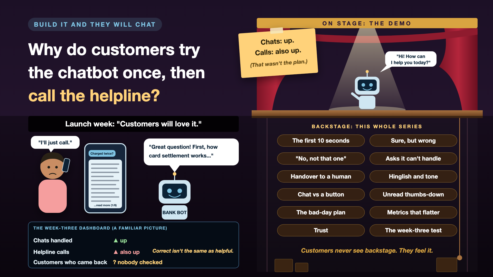

# 1. Why Do Customers Try the Bank's Chatbot Once and Then Call the Helpline?



*Build it and they will chat series: the curtain raiser*

"Customers will love the chatbot."

If you've sat in a digital banking review, you've heard it. The slide shows a chat bubble, the bank's logo and a cheerful "Hi! How can I help you today?" Everyone agrees it will take the pressure off the call centre. It's a very confident slide.

Picture the launch. Week one: 50,000 chats, and a lovely line in the town hall deck. Week three: the call centre is busier than before.

Nobody says the chatbot was wrong. Most of its answers were correct. Customers just didn't trust it with the next question.

## One chat, start to finish

A customer opens the app and types: "Why was I charged twice?"

The bot replies with six helpful paragraphs on how card payments first show as pending, then as settled, and how this can sometimes look like a double charge.

Every word is correct. The customer wanted one line: "Is my money coming back, and when?"

They close the app and call the helpline. Now the bank pays for the chat *and* the call.

## Why accurate isn't enough

Most AI projects test one thing: is the answer right? Customers judge something else: did it help me, quickly, without making me nervous?

- **Money makes people anxious.** A slow answer is forgiven. A confident wrong one about their account is not.
- **Trust is lost in a single chat.** One bad experience, and the customer goes straight to the helpline next time, without trying the bot first.
- **Customers don't read the scope document.** They ask whatever is on their mind, in their own words, often in two languages at once.
- **A chat that goes nowhere costs more than no chat.** The customer still calls, and is now annoyed before the agent even says hello.

Think of the chatbot as a new branch teller who knows every product brochure by heart, and has never met a customer. Very polite. Very well read. Never once seen someone panic about a missing 40,000 rupees.

## On stage, and backstage

On stage: a chat window and a model that can answer banking questions. That part really does take a few weeks. It also demos beautifully.

Backstage: everything that decides whether customers come back in week three. The first ten seconds. Saying "I'm not sure" when it isn't. Recovering when the customer says "no, not that one". Handing over to a human without making them repeat everything. Speaking the way customers actually speak. Knowing when a plain button would do the job better. The cover image is the full map.

## This is a series: here's what's coming

This write-up is the first in a series. Each one opens one door backstage and goes deep, with the same bank chatbot every time. A few of the questions it will answer:

- Your chatbot has 10 seconds. What does it do with them? (First impressions)
- Why does your chatbot sound so sure when it's wrong? (Confidence and tone)
- When should your chatbot say "Let me get a human"? (Handover)
- Does your chatbot speak Hinglish, or just banking English? (Language and tone)
- Does everything need to be a chat box? (Choosing the right interface)
- Your dashboard says customers love it. Do they? (Measuring what matters)

...and many more, from feedback buttons nobody reads to the day the bot embarrasses the bank on social media.

If you read my #JustAddRAG series, this is the other half of the story. That series was about getting the right answer. This one is about customers still walking away when the answer is right.

## Take this to your next kickoff meeting

1. Ask "will customers come back?", not just "is the answer correct?"
2. Read 50 real customer chats or call transcripts before designing a single bot reply.
3. Decide on day one how you'll measure whether the bot actually reduced calls.

A chatbot customers try once is a very expensive way to route calls to the helpline.

Next write-up (2): **Your chatbot has 10 seconds. What does it do with them?** (First impressions)

Follow me for the next one. And tell me: what made you give up on a company's chatbot and pick up the phone?

**Also by me:** [the #JustAddRAG series, starting with Why does "Just add RAG" sound like 2 weeks but take 6 months?](https://www.linkedin.com/pulse/why-does-just-add-rag-sound-like-2-weeks-take-6-months-arpit-jain-l4kkf/)

---

**Post text (copy and paste):**

```
"Customers will love the chatbot."

Week one: 50,000 chats. Week three: the call centre is busier than before.

The answers were mostly correct. Customers just didn't trust the bot with the next question.

Launch a chatbot that's accurate but not helpful, and you pay for it:
• Cost: you pay for the chat and the call that follows it
• Trust: one bad chat, and customers skip the bot next time
• Customer experience: people reach the agent already annoyed
• Credibility: "50,000 chats" on the dashboard, more calls in the queue

Write-up 1 in my new series, Build it and they will chat (#TheyWillChat): why accurate isn't enough, what sits backstage of every customer chatbot, and three things to take to your next kickoff meeting.

What made you give up on a chatbot and pick up the phone?

#AIEngineering #GenAI #ConversationalAI #CustomerExperience #TheyWillChat
```

**Series index (post as the first comment, then pin it):**

```
📌 Build it and they will chat: series index

1. Why do customers try the bank's chatbot once and then call the helpline? (you're here)
2. Your chatbot has 10 seconds. What does it do with them? (next write-up)

I'll keep this comment updated with each link as it goes live.
```
