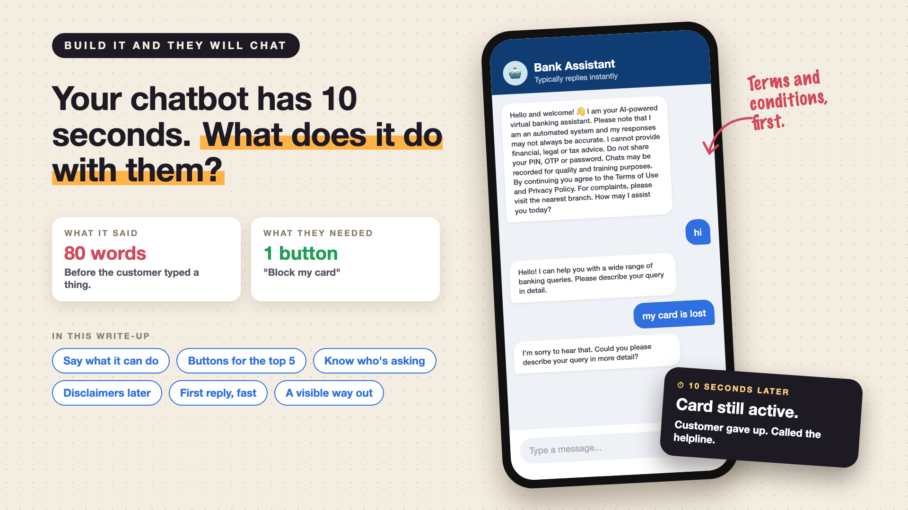

# 2. Your Chatbot Has 10 Seconds. What Does It Do With Them?



*Build it and they will chat series: First impressions*

A customer opens the bank's app at 11 PM. Their card is missing. They tap the chat icon.

The bot opens with eighty words: a warm welcome, a note that it's AI, a reminder not to share the PIN, a line about chats being recorded, a pointer to the Terms of Use, and finally, "How may I assist you today?"

The customer types "hi". The bot asks them to describe their query in detail. They type "my card is lost". The bot is sorry to hear that, and asks for more detail.

Ten seconds gone. The card is still active. The customer is dialling the helpline.

*New to terms like quick replies or authenticated context? Cheat sheet at the end.*

## Why the first 10 seconds matter

- **Customers decide fast.** In the first reply or two, they decide whether this thing can help them, or whether to call. Most never give it a second chance.
- **An empty box is hard.** A blinking cursor asks the customer to guess what the bot understands. Most guess "hi", which tells the bot nothing.
- **Worried customers have no patience.** Someone with a lost card or a strange debit wants action, not a welcome speech.
- **The opening sets the tone for everything after.** A clear, quick start makes the customer forgive small mistakes later. A confusing one makes them doubt every answer that follows.

## What usually goes wrong

- **The legal team writes the greeting.** Every disclaimer lands in the first message. *Fix: keep one short line on screen, and link the rest.*
- **The bot doesn't say what it can do.** Customers try things it can't, fail, and leave. *Fix: name three or four things it's good at, right away.*
- **No buttons, only a text box.** The most common tasks need typing. *Fix: offer one-tap options for the top five reasons people open the chat.*
- **The bot forgets the customer is logged in.** It asks which card, when the app already knows. *Fix: use what the app already knows, with care.*
- **The first reply is slow.** A spinner for six seconds feels like a minute. *Fix: show something useful immediately, and keep the first answer short.*
- **There is no visible way out.** Customers don't know they can reach a person. *Fix: show "Talk to us" from the first screen, not after three failures.*

## The toolkit, in plain words

1. **A shop sign, not a lecture**

   One short line that says who it is and what it can help with. "I can block cards, explain charges and check your EMI." That's a **capability statement**.
2. **Put the popular items at the counter**

   Buttons for the five things most people open the chat for: block card, recent transactions, EMI date, raise a complaint, talk to us. Those are **quick replies**, or **suggested actions**.
3. **Recognise the regular**

   The app knows who's logged in, which cards they hold, and their last few transactions. The bot can start there: "I can see a debit of 4,999 at 9:42 PM. Is this about that?" That's **authenticated context**, or **personalisation**.
4. **Fine print on request**

   Show the essentials first, and the rest only when it's needed. Not hidden, just not in the way. That's **progressive disclosure**.
5. **Answer quickly, even if briefly**

   Start showing the reply as it's written, and keep first answers to a line or two. That's **streaming**, and the delay before the first words appear is **time to first token**.
6. **Keep the door visible**

   A small, permanent "Talk to us" button. Knowing there's a way out makes people more willing to try the bot first. That's an **escalation path**.

## How it works in practice

The opening screen is designed, not left to the model. The greeting, the buttons and the "Talk to us" option are fixed in the app, and the model only steps in once the customer types or taps.

Pick the buttons from data, not opinions. Count why people called the helpline and opened the chat last quarter, and the top five reasons become the buttons. Review them every month.

Be careful with what the bot knows about the customer. Use it only after login, never in notifications, and never say more than the screen already shows.

**Product** owns the first screen. **Compliance** agrees on which disclaimers must show, and how short they can be. **Data** finds the top reasons people get in touch. **Engineering** builds and measures it.

## How do you know it works?

Measure the first ten seconds directly:

- How many customers leave before sending a second message?
- How many tap a button instead of typing?
- How long until the first useful answer?
- How many first messages are just "hi"? (Fewer means the opening is doing its job.)

## Cheat sheet: the words you'll hear, with examples

- **Capability statement:** a short line saying what the bot can do. *"I can block cards, explain charges and check your EMI."*
- **Quick replies (suggested actions):** buttons the customer can tap instead of typing. *"Block my card".*
- **Authenticated context:** what the app already knows because the customer is logged in. *Their cards and recent transactions.*
- **Personalisation:** using that context to tailor the reply. *"Is this about the 4,999 debit at 9:42 PM?"*
- **Progressive disclosure:** showing the essentials first and details only when needed. *One line on privacy, with a link to the full policy.*
- **Streaming:** showing the reply word by word as it's written. *The answer starts appearing in under a second.*
- **Time to first token:** how long before the first words of a reply appear. *The gap between tapping send and seeing the bot start to answer.*
- **Escalation path:** the route from the bot to a human. *A "Talk to us" button on every screen.*
- **Drop-off rate:** the share of customers who leave at a step. *Customers who never send a second message.*

## Take this to your next kickoff meeting

1. Design the opening screen on paper before anyone writes a prompt.
2. Build the first buttons from the top five reasons customers really get in touch.
3. Measure how many customers leave before their second message, from day one.

Customers don't read a chatbot's welcome. They decide in ten seconds whether to keep typing or start dialling.

Next write-up (3): **Why does your chatbot sound so sure when it's wrong?** (Confidence and tone)

Follow me for the next one. And tell me: what's the worst chatbot greeting you've ever seen?

**Earlier in this series:**

1. Why do customers try the bank's chatbot once and then call the helpline? *(link added when published)*

---

**Post text (copy and paste):**

```
A customer's card is missing. It's 11 PM. They open the bank's chatbot.

It greets them with 80 words of disclaimers. Then asks them to "describe the query in detail". Twice.

Ten seconds later, they're calling the helpline.

Waste the first 10 seconds, and you pay for it:
• Cost: the chat and the call it couldn't prevent
• Risk: a lost card stays active while the bot asks for "more detail"
• Trust: customers who leave in 10 seconds rarely try the bot again
• Data: "hi" tells you nothing about what customers needed

Write-up 2 in my series, Build it and they will chat (#TheyWillChat): capability statements, buttons for the top five tasks, using what the app already knows, and three things to take to your next kickoff meeting.

What's the worst chatbot greeting you've ever seen?

#AIEngineering #GenAI #ConversationalAI #CustomerExperience #TheyWillChat
```
