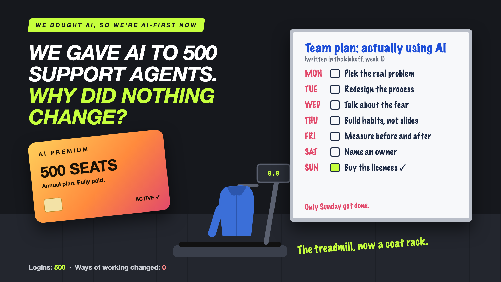

# 1. We Gave AI to 500 Support Agents. Why Did Nothing Change?



*We bought AI, so we're AI-first now series: the curtain raiser*

"We're rolling out AI to the whole support team."

Picture an e-commerce company with 500 customer-support agents. Leadership signs an annual licence for an AI assistant, one seat per agent. There's a two-hour training session, a launch email with a rocket emoji, and a dashboard that shows 500 logins by Friday.

Six months later, someone checks the numbers that matter. Average handling time: the same. Repeat contacts: the same. Customer ratings: the same.

The agents did use the AI. Mostly to make their emails sound more polite.

## Why this happens

Buying AI is a purchase. Changing how work gets done is a transformation. The first takes a signature. The second takes months.

- **The tool arrived, the work didn't change.** Agents still check the same three screens for a refund case. The AI just sits beside them.
- **Nobody picked the problem.** The licence was bought for "productivity", not for the 20-minute refund case that actually hurts.
- **People were trained on buttons, not habits.** Two hours teaches where to click. It doesn't change what an experienced agent does at 4 PM on a busy Monday.
- **Nobody measured "before".** So nobody can prove "after".

It's a gym membership. Paying for it feels like progress. The treadmill becomes a very expensive coat rack.

## What sits behind the licence

The licence is the easy part, and it's the only part that shows up in the press release.

The hard part is everything that turns a tool into a new way of working: choosing the problem, redesigning the process around it, talking honestly about people's worries, building habits instead of slides, measuring the right things, and giving the whole thing an owner after the launch party ends. The whiteboard on the cover is the full plan.

## This is a series: here's what's coming

This write-up is the first in a series. Each one takes one piece of the plan and goes deep, with the same 500-agent support team every time. A few of the questions it will answer:

- Which problem was the AI supposed to solve? (Starting from pain points)
- Why is the old process still running next to the new one? (Process redesign)
- Who is quietly afraid of the AI? (Fear and trust)
- Did the training teach tools or habits? (Learning that sticks)
- How do you know it's actually working? (Baselines and outcomes)

...and more, through to who owns the AI after the launch party.

## Take this to your next kickoff meeting

1. Name the one problem the AI must fix, in numbers, before buying a single seat.
2. Measure today's handling time and repeat contacts, so you can prove the change later.
3. Ask what the agent's day will look like differently, step by step, after the rollout.

Licences don't transform companies. Changed habits do.

Next write-up (2): **Which problem was the AI supposed to solve?** (Starting from pain points)

Follow me for the next one. And tell me: what's the most expensive "coat rack" you've seen in an AI rollout?

---

**Post text (copy and paste):**

```
500 support agents. 500 AI licences. One training session. 500 logins by Friday.

Six months later: same handling time, same repeat contacts, same ratings.

The agents used AI. Mostly to sound more polite in emails.

Treat a licence as a transformation, and you pay for it:
• Cost: a full year of seats for a tool that changed nothing
• Time: six months before anyone checks the numbers that matter
• Credibility: the next AI idea gets a much harder "no"
• People: agents learn that "transformation" means one more tool

Write-up 1 in my new series, We bought AI, so we're AI-first now (#AIFirstNow): why buying AI isn't changing work, what sits behind the licence, and three things to take to your next kickoff meeting.

What's the most expensive "coat rack" you've seen in an AI rollout?

#AIEngineering #GenAI #AITransformation #ChangeManagement #AIFirstNow
```

**Series index (post as the first comment, then pin it):**

```
📌 We bought AI, so we're AI-first now: series index

1. We gave AI to 500 support agents. Why did nothing change? (you're here)
2. Which problem was the AI supposed to solve? (next write-up)

I'll keep this comment updated with each link as it goes live.
```
