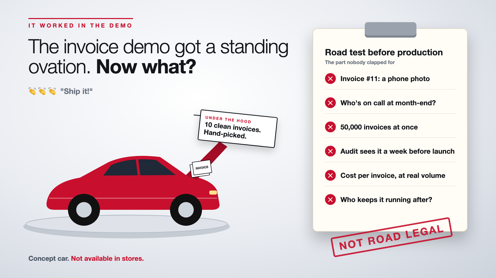

# 1. The Invoice Demo Got a Standing Ovation. Now What?



*It worked in the demo series: the curtain raiser*

"Let's just put it into production."

Picture the finance town hall. The accounts payable team shows an AI that reads supplier invoices and matches them to purchase orders. Ten PDFs go in. Supplier name, invoice number, amount, tax, PO number: all correct, in seconds. Someone at the back starts clapping. Then everyone does.

The CFO asks the obvious question: "When can we go live?" Someone says, "A few weeks?"

Then invoice number eleven arrives. It's a phone photo of a crumpled page, taken at an angle, with a coffee ring over the total.

## Why demos and production are different worlds

A proof of concept proves something *can* work. Production proves it works every day, on every invoice, for every supplier, at month-end, when the person who built it is on leave.

- **Demos are hand-picked.** Those ten invoices were clean, digital and from familiar suppliers. Real invoices come as scans, photos, multi-page PDFs and three currencies.
- **Demos have fans. Production needs owners.** Somebody has to be on call when it breaks at month-end close.
- **Demos run once. Production runs at volume.** Ten invoices is a test. Fifty thousand at quarter-end is a load problem and a bill.
- **Demos skip the reviews.** Audit, security and compliance meet it for the first time a week before launch. That's when launches slip.

A concept car at a motor show looks magnificent on its turntable. It has never seen a pothole, a monsoon or a parking ticket.

## What sits between the applause and go-live

The demo is the shiny part. What decides whether finance trusts it in month three is everything around it: real-world documents, owners and on-call, scale and queues, controls and audit trails, the running cost per invoice, and who maintains it when a big supplier changes its invoice layout. The clipboard on the cover is the full road test.

## This is a series: here's what's coming

This write-up is the first in a series. Each one takes one piece of the road test and goes deep, with the same invoice system every time. A few of the questions it will answer:

- Why does it work on 10 invoices and fail on 10,000? (Real data)
- Who gets called when it breaks at month-end? (Ownership)
- What happens when 50,000 invoices arrive at once? (Scale)
- Is audit seeing it for the first time a week before launch? (Controls)
- What does it cost when every invoice goes through it? (Unit economics)

...and more, through to who keeps it working after launch.

## Take this to your next kickoff meeting

1. Test the demo on 200 real, ugly invoices before anyone gives a go-live date.
2. Name the owner and the on-call person before the build starts, not after it breaks.
3. Invite audit and security to the second demo, not the last one.

A standing ovation is a lovely start. It isn't a production plan.

Next write-up (2): **Why does it work on 10 invoices and fail on 10,000?** (Real data)

Follow me for the next one. And tell me: what was "invoice number eleven" in your last AI project?

---

**Post text (copy and paste):**

```
Ten invoices. All read perfectly. The room clapped. "When can we go live?"

Then invoice eleven arrived: a phone photo with a coffee ring over the total.

Treat a great demo as a production plan, and you pay for it:
• Accuracy: real invoices are scans, photos and three currencies
• Availability: nobody on call when it breaks at month-end close
• Cost: a bill nobody estimated, at 50,000 invoices a quarter
• Time: audit sees it a week before launch, and the date slips

Write-up 1 in my new series, It worked in the demo (#ItWorkedInTheDemo): why a POC and production are different worlds, what sits between the applause and go-live, and three things to take to your next kickoff meeting.

What was "invoice number eleven" in your last AI project?

#AIEngineering #GenAI #EnterpriseAI #AIinFinance #ItWorkedInTheDemo
```

**Series index (post as the first comment, then pin it):**

```
📌 It worked in the demo: series index

1. The invoice demo got a standing ovation. Now what? (you're here)
2. Why does it work on 10 invoices and fail on 10,000? (next write-up)

I'll keep this comment updated with each link as it goes live.
```
