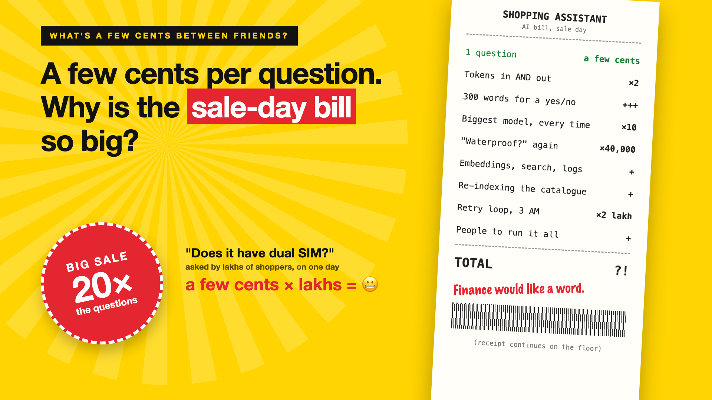

# 1. A Few Cents per Question. Why Is the Sale-Day Bill So Big?



*What's a few cents between friends? series: the curtain raiser*

"It's only a few cents per question."

Picture a shopping site that adds an AI assistant to every product page. Shoppers ask: "Does this phone support dual SIM?", "Will this fit a 6-foot bed?", "Is it waterproof?" In the pilot, the bill is tiny. A few cents a question. Finance barely notices.

Then the big sale arrives. Traffic jumps twenty times. The same questions come from lakhs of shoppers in a single day, and every one of them is answered fresh, at full price, by the biggest model available.

The bill for that week arrives in finance's inbox like a party invitation nobody asked for.

## Why small numbers stop being small

AI is paid for per use, not per licence. That sounds safe until you remember that use always grows, and grows fastest on your busiest days.

- **You pay by the word, both ways.** Every question and every answer is counted. A 300-word reply to a yes-or-no question costs much more than "Yes, it supports dual SIM."
- **The biggest model answers everything.** Nobody decided which questions deserve the expensive brain. "What colours does it come in?" gets a professor.
- **The same answer is paid for again and again.** "Is it waterproof?" asked 40,000 times is 40,000 separate bills.
- **The model is only one line on the bill.** Search, embeddings, storage, logs, re-indexing the catalogue and the people who run it all add up.
- **One bug can burn a month's budget.** A retry loop at 3 AM doesn't get tired.

A few cents is a lovely number on a slide. Multiplied by a sale day, it's a different conversation.

## What sits behind "a few cents"

The price per question is the visible part. What decides the real bill is everything behind it: how many tokens each answer uses, which model handles which question, whether repeated answers are reused, what else runs for every question, and whether anything stops a runaway bill before morning. The receipt on the cover is the full list.

## This is a series: here's what's coming

This write-up is the first in a series. Each one takes one line of the bill and goes deep, with the same shopping assistant every time. A few of the questions it will answer:

- What is a token, and why are you paying for it? (Tokens)
- Do you need the biggest model for every question? (Model choice)
- Why pay twice for the same answer? (Caching)
- What else is hiding on the bill? (The full cost)
- How do you stop a runaway bill? (Budgets and limits)

...and a final write-up on estimating the real cost before you build.

## Take this to your next kickoff meeting

1. Multiply the cost per question by your sale-day traffic, not your pilot traffic.
2. Ask which questions really need the biggest model.
3. Set a daily budget alert before launch, not after the first surprise.

AI costs aren't scary because they're big. They're scary because nobody multiplied them in advance.

Next write-up (2): **What is a token, and why are you paying for it?** (Tokens)

Follow me for the next one. And tell me: what's the biggest "only a few cents" surprise you've seen?

---

**Post text (copy and paste):**

```
"It's only a few cents per question."

Then the big sale arrives. Twenty times the traffic. "Is it waterproof?" answered 40,000 times, fresh, by the biggest model.

Assume a few cents stays small, and you pay for it:
• Cost: a sale-day bill nobody multiplied in advance
• Waste: the same answer paid for thousands of times
• Risk: one retry loop can burn a month's budget overnight
• Trust: finance stops saying yes to the next AI idea

Write-up 1 in my new series, What's a few cents between friends? (#FewCentsMore): why small AI costs stop being small, what's really on the bill, and three things to take to your next kickoff meeting.

What's the biggest "only a few cents" surprise you've seen?

#AIEngineering #GenAI #FinOps #AICost #FewCentsMore
```

**Series index (post as the first comment, then pin it):**

```
📌 What's a few cents between friends?: series index

1. A few cents per question. Why is the sale-day bill so big? (you're here)
2. What is a token, and why are you paying for it? (next write-up)

I'll keep this comment updated with each link as it goes live.
```
