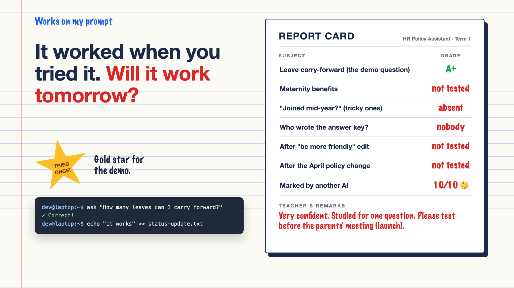

# 1. It Worked When You Tried It. Will It Work Tomorrow?



*Works on my prompt series: the curtain raiser*

"I tried it, and it works."

Picture an HR policy assistant for a company's employees. The developer asks it, "How many leaves can I carry forward?" It answers correctly, with the right policy section. A screenshot goes into the status update. Green tick. Ship it.

Three weeks after launch, an employee asks about maternity benefits and gets last year's rule. Another, who joined mid-year, gets an answer meant for full-year staff. Someone changes the prompt to "be more friendly", and it quietly forgets the probation rules.

Nobody noticed, because nobody was checking. The test plan was one question, asked once, on a laptop.

## Why "I tried it" isn't a test

Traditional software gives the same output for the same input. AI doesn't, quite. It can be right on Monday and wrong on Wednesday, and still sound equally confident both times.

- **One question proves one question.** The demo question is always the easy one.
- **Real questions are tricky.** "Can I carry forward leave if I joined in July and I'm still on probation?" is where answers go wrong.
- **Small changes have big side effects.** Fix the tone, break the facts. Nothing warns you.
- **Things change underneath you.** A new policy in April, a new model version from the provider: same question, different answer.
- **"Looks good to me" doesn't scale.** Nobody can read 10,000 answers a week by hand.

It's a student who studied for exactly one exam question and got full marks on it. Lovely result. Please don't let them sit the real exam yet.

## What sits behind "it works"

The demo is the visible part. What keeps an AI trustworthy every week is a proper testing habit: a set of real test questions, an answer key written by the people who actually know, a way to mark thousands of answers quickly, checks that run on every change, and a plan for when the policy or the model changes. Teams call this **evals**, short for evaluations. The report card on the cover shows how most launches score today.

## This is a series: here's what's coming

This write-up is the first in a series. Each one takes one part of testing and goes deep, with the same HR assistant every time. A few of the questions it will answer:

- What should your test questions look like? (Test sets)
- Who writes the right answers? (Ground truth)
- Can an AI grade another AI? (LLM as a judge)
- Why did a tiny prompt change break everything? (Regression tests)
- What happens when the model or the policy changes? (Keeping tests current)

...and a final write-up with a checklist for testing AI properly.

## Take this to your next kickoff meeting

1. Write 30 real test questions, including tricky and unanswerable ones, before launch.
2. Ask who will write the correct answers, and book their time.
3. Agree that every prompt change runs the full test set before it ships.

"It worked when I tried it" is a demo. "It passed 300 questions this morning" is a test.

Next write-up (2): **What should your test questions look like?** (Test sets)

Follow me for the next one. And tell me: how many questions did your last AI project test before someone said "it works"?

---

**Post text (copy and paste):**

```
"I tried it, and it works."

One question. Asked once. On a laptop. Green tick in the status update.

Three weeks later: last year's maternity rule, wrong answers for mid-year joiners, and a "be more friendly" edit that broke the probation rules.

Ship on "I tried it", and you pay for it:
• Accuracy: wrong answers nobody notices until employees complain
• Trust: one wrong HR answer, and people go back to emailing HR
• Risk: policy answers that create real disputes
• Speed: every change becomes scary, because nothing checks it

Write-up 1 in my new series, Works on my prompt (#WorksOnMyPrompt): why trying it isn't testing it, what evals really are, and three things to take to your next kickoff meeting.

How many questions did your last AI project test before someone said "it works"?

#AIEngineering #GenAI #LLMEvals #AITesting #WorksOnMyPrompt
```

**Series index (post as the first comment, then pin it):**

```
📌 Works on my prompt: series index

1. It worked when you tried it. Will it work tomorrow? (you're here)
2. What should your test questions look like? (next write-up)

I'll keep this comment updated with each link as it goes live.
```
