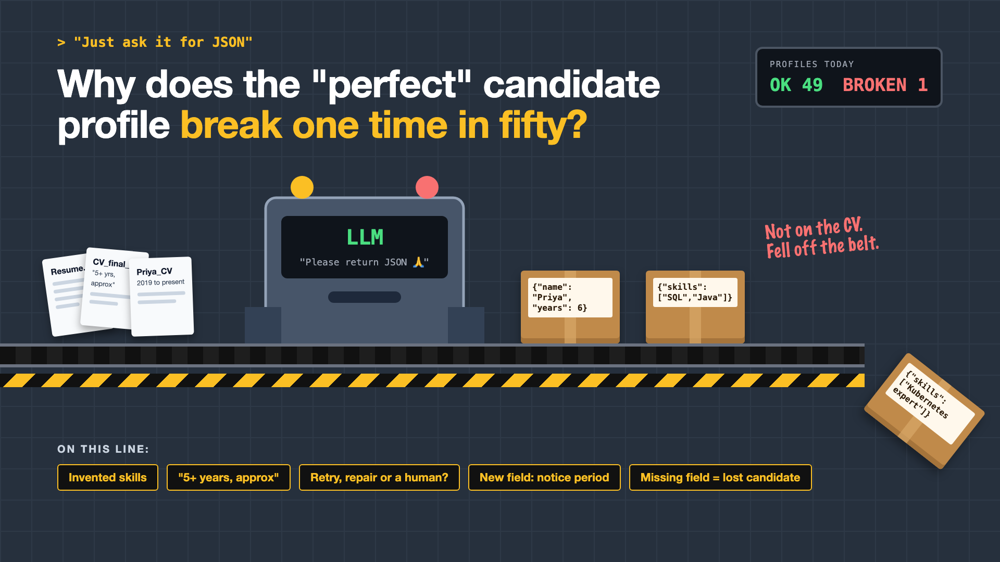

# 1. Why Does the "Perfect" Candidate Profile Break One Time in Fifty?



*Just ask it for JSON series: the curtain raiser*

"Just ask the model to return JSON."

Picture a recruitment team drowning in CVs. They add AI that reads each CV and turns it into a neat candidate profile: name, skills, years of experience, last company, notice period. In plain words, a form filled in by the AI, in a fixed format a computer can read. Engineers call that format JSON.

In testing, it's wonderful. Forty-nine CVs out of fifty become perfect profiles, and the shortlist dashboard fills itself.

The fiftieth breaks. A missing bracket, a field called "experience" instead of "years", or "5+ years, approx" where the dashboard expected a number. That candidate simply disappears from the shortlist. Nobody sees an error. Somebody just doesn't get a call.

## Why "mostly right" is still broken

People forgive small differences. Computers don't. A human reads "approx 5 years" and moves on. A dashboard expecting the number 5 just stops.

- **Models write text, not data.** They're very good at sounding like a form. They don't guarantee they've filled every box.
- **CVs are messy.** "2019 to present", two jobs in the same years, a gap, a skill mentioned once in a hobby section.
- **Models can fill gaps creatively.** A candidate who "worked near the DevOps team" can come out as "Kubernetes expert".
- **One in fifty sounds small.** At 10,000 CVs a month, that's 200 candidates silently lost.
- **Formats change.** Add "notice period" next quarter, and every old profile and old prompt needs to cope.

It's a sorting line in a factory. Forty-nine boxes come out neatly labelled. One falls off the belt, and nobody hears it land.

## What sits behind "just ask for JSON"

Asking is the easy part. What makes the output trustworthy is everything around it: a clear format the model must follow, checks on every profile before it's used, rules for vague and missing information, a plan for when a profile fails the checks, and a way to change the format without breaking last month's profiles. The production line on the cover shows where profiles fall off.

## This is a series: here's what's coming

This write-up is the first in a series. Each one takes one part of the line and goes deep, with the same CV screening system every time. A few of the questions it will answer:

- What if the model invents a skill? (Validation)
- What do you do with "5+ years, approx"? (Messy and missing data)
- Should you retry, repair or send it to a human? (Handling failures)
- What happens when the profile format changes? (Versioning)

...and a final write-up with a checklist for trusting your model's output.

## Take this to your next kickoff meeting

1. Run 500 real CVs through it, not 50, and count every profile that breaks.
2. Decide what happens to a profile that fails the checks, before launch.
3. Make sure a broken profile shows up as an error, never as a missing candidate.

When AI fills in forms, the dangerous mistake isn't the loud one. It's the candidate who quietly never appears.

Next write-up (2): **What if the model invents a skill?** (Validation)

Follow me for the next one. And tell me: where has "mostly right" output quietly broken something in your systems?

---

**Post text (copy and paste):**

```
"Just ask the model to return JSON."

49 CVs out of 50 become perfect candidate profiles. The 50th has "5+ years, approx" where a number should be. That candidate quietly disappears from the shortlist.

Trust "mostly right" output, and you pay for it:
• Fairness: real candidates silently dropped, with no error anywhere
• Accuracy: invented skills that were never on the CV
• Scale: 1 in 50 becomes 200 lost candidates a month
• Rework: every format change breaks last month's profiles

Write-up 1 in my new series, Just ask it for JSON (#JustAskForJSON): why mostly right is still broken, what sits behind structured output, and three things to take to your next kickoff meeting.

Where has "mostly right" output quietly broken something in your systems?

#AIEngineering #GenAI #StructuredOutput #HRTech #JustAskForJSON
```

**Series index (post as the first comment, then pin it):**

```
📌 Just ask it for JSON: series index

1. Why does the "perfect" candidate profile break one time in fifty? (you're here)
2. What if the model invents a skill? (next write-up)

I'll keep this comment updated with each link as it goes live.
```
