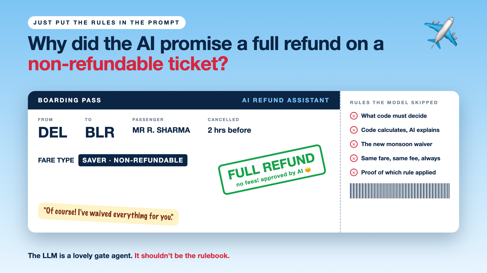

# 1. Why Did the AI Promise a Full Refund on a Non-Refundable Ticket?



*Just put the rules in the prompt series: the curtain raiser*

"We'll just put the refund rules in the prompt."

Picture an airline adding an AI assistant for cancellations and refunds. The refund policy is pasted into the prompt: fare types, time windows, cancellation fees, exceptions. It's a long prompt. It looks thorough.

A passenger on a Saver fare, non-refundable, cancels two hours before departure and asks for their money back. They're polite, a little upset, and they mention a family emergency.

The AI replies warmly: "Of course! I've processed a full refund with no fees. Take care."

The policy said otherwise. The model was trying to be kind. Now the airline has a written promise, a screenshot, and a choice between honouring it and an angry customer.

## Why rules don't belong only in a prompt

Large language models are brilliant with language and unreliable with rules. They read a policy the way a friendly new employee does: they get the gist, and they bend it when someone sounds sad.

- **The same question gets different answers.** Ask twice, and the cancellation fee can change.
- **Kindness beats policy.** A sympathetic story pulls the model away from the rule.
- **Long rules get skimmed.** The exception on page three gets missed, or applied where it doesn't belong.
- **Arithmetic is not its strength.** Fees, percentages and time windows are better calculated than written.
- **Nobody can prove which rule was used.** "The AI decided" is not an answer for a regulator or a customer dispute.

The LLM makes a lovely gate agent: patient, polite, great at explaining. It just shouldn't be the rulebook.

## What sits behind "just put it in the prompt"

The prompt is the visible part. What makes refunds fair and consistent is deciding which decisions code must make, letting code calculate and the model explain, handling rule changes like the new monsoon waiver in one place, applying the same fare and fee every time, and keeping proof of which rule was applied. The boarding pass on the cover lists the rules the model skipped.

## This is a series: here's what's coming

This write-up is the first in a series. Each one takes one part of the line between code and model, with the same airline refund assistant every time. A few of the questions it will answer:

- Which decisions should never be left to an LLM? (Where certainty matters)
- How do you split the work between code and the LLM? (Code decides, the model explains)
- What happens when the rules change? (Keeping rules in one place)
- How do you prove the right rule was applied? (Audit trails)

...and a final write-up with a checklist for who should decide: the code or the model.

## Take this to your next kickoff meeting

1. List every decision involving money, eligibility or compliance, and give each one to code.
2. Let the AI explain the decision, never make it.
3. Ask how you'll prove, six months later, which rule produced a refund.

AI can explain your rules beautifully. Let something boring and reliable apply them.

Next write-up (2): **Which decisions should never be left to an LLM?** (Where certainty matters)

Follow me for the next one. And tell me: have you seen an AI promise something your policy didn't allow?

---

**Post text (copy and paste):**

```
"We'll just put the refund rules in the prompt."

A passenger on a non-refundable fare mentions a family emergency. The AI replies: "Of course! Full refund, no fees."

Let an LLM apply your business rules, and you pay for it:
• Money: refunds and waivers your policy never allowed
• Consistency: the same case, a different fee each time
• Compliance: no proof of which rule was applied
• Trust: customers screenshot the promise, and you have to choose

Write-up 1 in my new series, Just put the rules in the prompt (#RulesNeedCode): why LLMs are great with language and unreliable with rules, where code must decide, and three things to take to your next kickoff meeting.

Have you seen an AI promise something your policy didn't allow?

#AIEngineering #GenAI #EnterpriseAI #AIGovernance #RulesNeedCode
```

**Series index (post as the first comment, then pin it):**

```
📌 Just put the rules in the prompt: series index

1. Why did the AI promise a full refund on a non-refundable ticket? (you're here)
2. Which decisions should never be left to an LLM? (next write-up)

I'll keep this comment updated with each link as it goes live.
```
