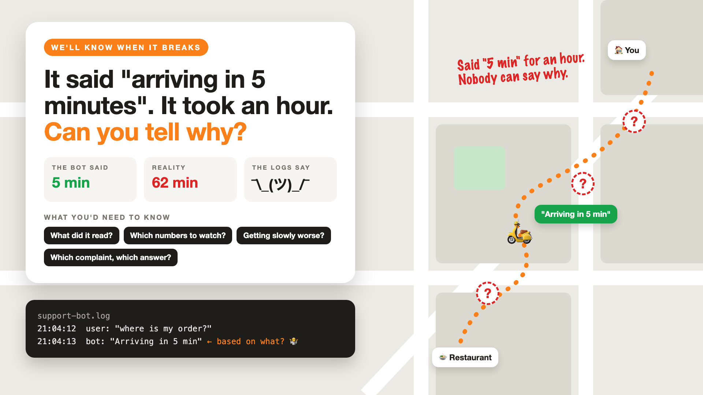

# 1. It Said "Arriving in 5 Minutes". It Took an Hour. Can You Tell Why?



*We'll know when it breaks series: the curtain raiser*

"If something goes wrong, we'll check the logs."

Picture a food-delivery app's support bot. A hungry customer asks, "Where's my order?" The bot replies, "Arriving in 5 minutes." Twenty minutes later, they ask again. "Arriving in 5 minutes." The food arrives after an hour, cold, along with a one-star review and a screenshot on social media.

The support lead asks a simple question: why did the bot keep saying five minutes?

The team opens the logs. They show the customer's question, the bot's answer, and a timestamp. That's all. Did the bot read old tracking data? The wrong order? Did a prompt change last week? Nobody can tell.

## Why "we'll check the logs" isn't enough

Normal software fails loudly: an error, a crash, a red light. AI fails politely. It gives a confident, well-written, wrong answer, and nothing anywhere turns red.

- **The answer isn't the whole story.** To explain it, you need what the bot read, which tools it called, and what it was told.
- **A thumbs-down without context is a riddle.** "Wrong!" Which answer? Which order? Which version of the bot?
- **Quality slides slowly.** New restaurant partners, new menu formats, a model update: answers get a little worse each week, and nobody notices until reviews do.
- **A few numbers tell most of the story.** If nobody watches them, the story stays untold.

It's a delivery map with the rider dot frozen in place and question marks along the route.

## What sits behind "we'll check the logs"

A log line is the visible part. What lets you explain a wrong answer in minutes is everything behind it: recording every step of every answer, a handful of numbers watched daily, spotting quality that slowly gets worse, and connecting each complaint to exactly what happened. Teams call this **observability**. The questions on the cover are the ones your logs should be able to answer.

## This is a series: here's what's coming

This write-up is the first in a series. Each one takes one part of seeing inside your AI and goes deep, with the same delivery support bot every time. A few of the questions it will answer:

- What should you record for every answer? (Traces)
- Which numbers should you watch every day? (Metrics and alerts)
- Why is it slowly getting worse? (Drift)
- How do you connect a complaint to what happened? (Feedback and replay)

...and a final write-up with an observability checklist.

## Take this to your next kickoff meeting

1. Ask the team to explain one wrong answer from the logs, live, in five minutes.
2. Record what the bot read and which tools it called, not just what it said.
3. Pick three numbers to watch daily, and decide who gets the alert.

If you can't explain a wrong answer, you can't fix it. You can only apologise for it.

Next write-up (2): **What should you record for every answer?** (Traces)

Follow me for the next one. And tell me: how long did it take your team to explain the last wrong AI answer?

---

**Post text (copy and paste):**

```
"Arriving in 5 minutes." Said three times. The food took an hour.

The team opened the logs: question, answer, timestamp. Nothing about what the bot read or why.

Launch AI without observability, and you pay for it:
• Time: hours of guessing for every wrong answer
• Trust: the same mistake repeats while nobody can find the cause
• Reputation: customers find the problem on social media before you do
• Quality: slow decline nobody notices until the reviews do

Write-up 1 in my new series, We'll know when it breaks (#WeWillKnow): why AI fails politely, what your logs should be able to answer, and three things to take to your next kickoff meeting.

How long did it take your team to explain the last wrong AI answer?

#AIEngineering #GenAI #Observability #LLMOps #WeWillKnow
```

**Series index (post as the first comment, then pin it):**

```
📌 We'll know when it breaks: series index

1. It said "arriving in 5 minutes". It took an hour. Can you tell why? (you're here)
2. What should you record for every answer? (next write-up)

I'll keep this comment updated with each link as it goes live.
```
