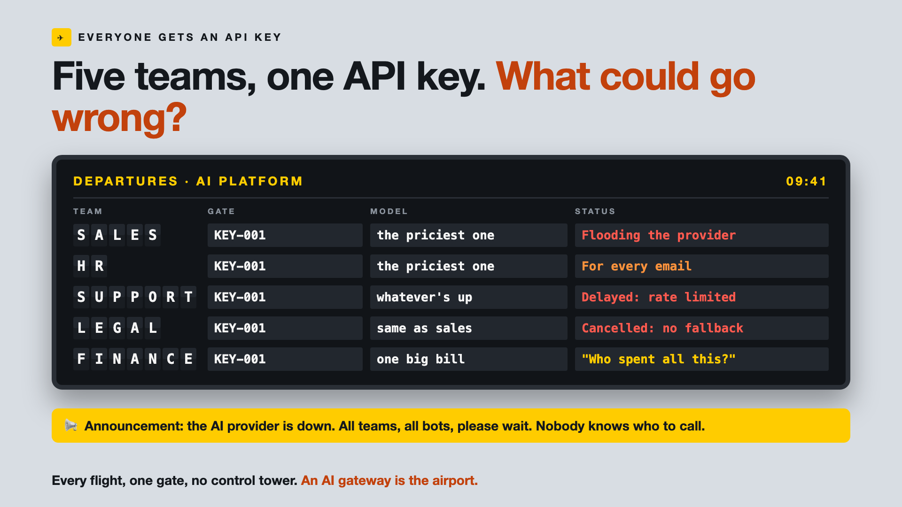

# 1. Five Teams, One API Key. What Could Go Wrong?



*Everyone gets an API key series: the curtain raiser*

"Just call the model's API directly. It's one line of code."

Picture a 5,000-person company. Sales builds a bot to draft proposals. HR builds one for policy questions. Support builds a customer chatbot. Legal builds one to summarise contracts. Finance watches. Each team moves fast, and each one calls the same AI provider, often with the same API key, the password that lets software use the model.

For a few months, it's wonderful. Then, on one Monday morning:

Sales launches a campaign and floods the provider with requests. Support's customer chatbot slows to a crawl, because they share the same limits. The provider has a short outage, and every bot in the company goes silent at once. And finance receives one large AI invoice with no idea which team spent what.

## Why "one line of code" becomes a company problem

Calling a model directly is perfect for one team and one project. When every team does it separately, nobody is looking after the whole.

- **Shared keys mean shared blame.** When something goes wrong, or the budget runs out, nobody knows whose bot did it.
- **One busy team slows everyone.** Providers limit how many requests you can send. A spike in one team eats the limit for all.
- **Everyone picks the priciest model.** HR's policy bot doesn't need the most expensive brain to answer leave questions.
- **One provider means one point of failure.** When it's down, every bot is down.
- **Security and rules are copied, or forgotten.** Each team reinvents logging, data protection and access, or skips them.

It's an airport where every airline uses one gate and there's no control tower.

## What sits behind "just call the API"

The API call is the visible part. What a company needs, once many teams use AI, is a single front door: one place that controls who can use which model, shares capacity fairly, switches to a backup when a provider fails, and shows who spent what. Teams call this an **AI gateway**. The departures board on the cover shows life without one.

## This is a series: here's what's coming

This write-up is the first in a series. Each one takes one job of the front door and goes deep, with the same 5,000-person company every time. A few of the questions it will answer:

- Who is allowed to use which model? (Access and model policies)
- What happens when one team floods the provider? (Rate limits and quotas)
- What if the AI provider goes down? (Fallbacks)
- Who spent what, on what? (Cost tracking and governance)

...and a final write-up with a gateway checklist.

## Take this to your next kickoff meeting

1. Count how many teams already call AI providers directly, and with how many keys.
2. Give every team its own key and budget, even before you build anything bigger.
3. Ask what happens to every bot in the company if the provider is down for an hour.

One team calling AI is a project. Twenty teams calling AI is a platform, whether you planned one or not.

Next write-up (2): **Who is allowed to use which model?** (Access and model policies)

Follow me for the next one. And tell me: how many API keys does your company have for the same AI provider?

---

**Post text (copy and paste):**

```
Sales, HR, Support, Legal. Four bots. One AI provider. Often one API key.

Then one Monday: Sales floods the provider, Support's chatbot crawls, a short outage silences every bot, and finance gets one big invoice with no names on it.

Let every team call the model directly, and you pay for it:
• Availability: one provider outage takes down every bot at once
• Performance: one busy team slows everyone else
• Cost: the priciest model for every email, and no way to split the bill
• Security: logging and data rules reinvented, or skipped, by each team

Write-up 1 in my new series, Everyone gets an API key (#OneFrontDoor): why one line of code becomes a company problem, what an AI gateway does, and three things to take to your next kickoff meeting.

How many API keys does your company have for the same AI provider?

#AIEngineering #GenAI #AIGateway #PlatformEngineering #OneFrontDoor
```

**Series index (post as the first comment, then pin it):**

```
📌 Everyone gets an API key: series index

1. Five teams, one API key. What could go wrong? (you're here)
2. Who is allowed to use which model? (next write-up)

I'll keep this comment updated with each link as it goes live.
```
