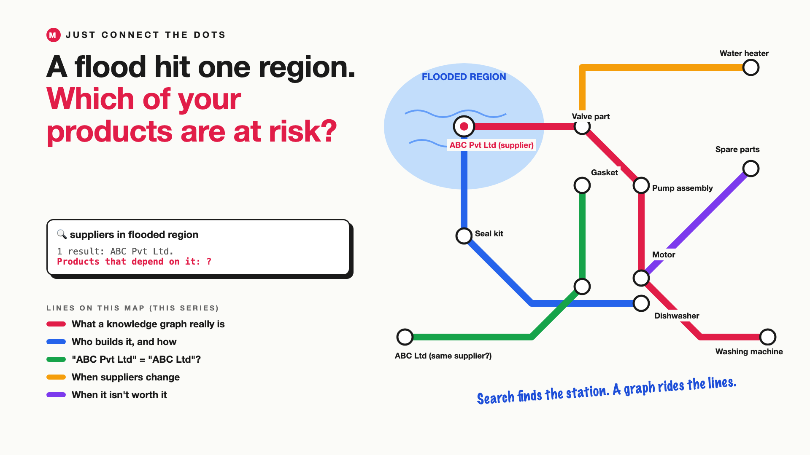

# 1. A Flood Hit One Region. Which of Your Products Are at Risk?



*Just connect the dots series: the curtain raiser*

"Let's just add a knowledge graph."

Picture a manufacturer of home appliances. Overnight, floods hit an industrial region. The COO asks the supply-chain team one urgent question: which of our products depend on a supplier there?

The team already has an AI assistant over its documents: supplier contracts, bills of materials, purchase orders. They ask it. It finds the supplier, ABC Pvt Ltd, located in the flooded region, with a lovely summary of the contract.

That's not what the COO asked. ABC supplies a valve. The valve goes into a pump assembly. The pump goes into the washing machine and the dishwasher. And "ABC Ltd", spelt slightly differently in another system, supplies the gasket for the water heater. The answer lives in the *connections*, not in any single document.

## Why some questions are about connections

Most AI search, including the RAG systems many companies run today, is great at finding the most relevant passages. It's not built to follow a chain of links, several steps deep.

- **Search finds things. It doesn't follow them.** It finds the supplier page, not every product that depends on it, two or three steps away.
- **The chain is spread across systems.** Contracts in one place, bills of materials in another, product lists in a third.
- **Names don't match.** "ABC Pvt Ltd", "ABC Private Limited" and "ABC Ltd" may be one supplier, or three.
- **The links change.** A part moves to a new supplier, and yesterday's answer is wrong today.
- **Not every question needs this.** "What's ABC's address?" doesn't need a graph. Knowing when it's worth it matters as much as building it.

Think of a metro map. Search tells you a station exists. A graph tells you every line that runs through it, and where those lines go.

## What sits behind "just add a knowledge graph"

The idea is the easy part. A **knowledge graph** stores things (suppliers, parts, products) as dots, and their relationships ("supplies", "used in") as lines, so an AI can follow the lines. The real work is deciding what goes on the map, pulling the dots and lines out of messy documents, cleaning up duplicate names, keeping it current as suppliers change, and being honest about when it isn't worth the effort. Using a graph to help an AI answer is often called **GraphRAG**. The metro map on the cover shows the idea.

## This is a series: here's what's coming

This write-up is the first in a series. Each one takes one part of the map and goes deep, with the same supplier-risk question every time. A few of the questions it will answer:

- What is a knowledge graph, really? (Dots, lines and meaning)
- Who builds the graph, and how? (Extraction and cleaning)
- What happens when suppliers change? (Keeping it current)
- When is a graph worth the effort? (GraphRAG vs plain RAG)

...and a final write-up with a checklist for deciding whether to add one.

## Take this to your next kickoff meeting

1. Write down five real questions, and mark which ones need following links two or more steps deep.
2. Check how many ways your systems spell the same supplier.
3. Ask who will keep the links current after the first build.

When the answer is a chain, don't hand your AI a pile of pages. Hand it the map.

Next write-up (2): **What is a knowledge graph, really?** (Dots, lines and meaning)

Follow me for the next one. And tell me: what's a question in your business that only makes sense as a chain of links?

---

**Post text (copy and paste):**

```
A flood hits one region. The COO asks: which of our products depend on a supplier there?

The AI finds the supplier and summarises the contract. But the answer is a chain: supplier, valve, pump, washing machine. Plus "ABC Ltd", spelt differently, behind the water heater.

Use plain search for connection questions, and you pay for it:
• Risk: products at risk that nobody listed
• Accuracy: the same supplier counted as three, or missed entirely
• Time: analysts rebuilding the chain by hand during a crisis
• Cost: or the opposite mistake, a graph built for questions that never needed one

Write-up 1 in my new series, Just connect the dots (#JustConnectTheDots): why some questions are about connections, what a knowledge graph really takes, and three things to take to your next kickoff meeting.

What's a question in your business that only makes sense as a chain of links?

#AIEngineering #GenAI #KnowledgeGraph #GraphRAG #JustConnectTheDots
```

**Series index (post as the first comment, then pin it):**

```
📌 Just connect the dots: series index

1. A flood hit one region. Which of your products are at risk? (you're here)
2. What is a knowledge graph, really? (next write-up)

I'll keep this comment updated with each link as it goes live.
```
