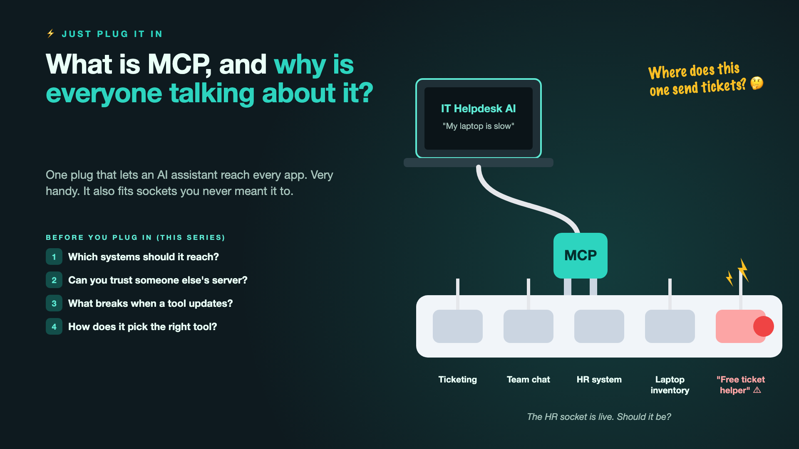

# 1. What Is MCP, and Why Is Everyone Talking About It?



*Just plug it in series: the curtain raiser*

"Let's just add an MCP server."

Picture a company's IT helpdesk. An employee types, "My laptop is slow." To help properly, an AI assistant would need to look up their open tickets, check the laptop's age in the inventory, see if there's an outage announced in team chat, and maybe check whether they're a new joiner in the HR system.

Not long ago, connecting an AI to each of those systems meant writing a custom connector for every one. Now there's **MCP**, the Model Context Protocol: a common standard that lets an AI assistant plug into many tools the same way. Think of it as a universal travel adapter. One plug, every socket.

So the team plugs in the ticketing tool, team chat, the laptop inventory, and the HR system. Someone also finds a free "ticket helper" MCP server online that promises nicer ticket summaries. Plug, plug, plug. It works in an afternoon.

That's exactly why everyone is talking about it. And exactly why it deserves a second look.

## Why a universal plug needs care

MCP really does make connecting AI to tools much easier. That's the good news, and it's real. The catch is that easy connections are easy to make without thinking.

- **Every socket is a new door.** The assistant needed laptop details. Did it need to read the HR system too?
- **Not every plug is yours.** A third-party MCP server sees whatever you send it. Where does that "free ticket helper" keep the tickets?
- **Tools change shape.** The ticketing tool updates its API, and the assistant's requests start failing on a Monday morning.
- **More tools, more confusion.** With twenty tools connected, "reset my password" can go to the laptop inventory.
- **MCP connects. It doesn't decide.** It doesn't choose what the assistant should be allowed to do. People still have to.

A universal adapter is wonderful when travelling. You still check the voltage before plugging in.

## What sits behind "just add an MCP server"

The plug is the easy part. What makes it safe and useful is choosing which systems the assistant may reach and what it may do there, deciding which third-party servers to trust, handling updates without breaking everything, and helping the assistant pick the right tool for each request. The power strip on the cover shows the sockets, including the one nobody checked.

## This is a series: here's what's coming

This write-up is the first in a series. Each one takes one question about plugging in and goes deep, with the same IT helpdesk assistant every time. A few of the questions it will answer:

- Which systems should your assistant be allowed to reach? (Least privilege)
- Can you trust someone else's MCP server? (Third-party trust)
- What happens when a connected tool changes? (Versioning)
- How does the assistant pick the right tool? (Tool selection)

...and a final write-up with an MCP checklist.

## Take this to your next kickoff meeting

1. List every system the assistant connects to, and ask why each one is needed.
2. Treat a third-party MCP server like any vendor: review it before plugging it in.
3. Give each connection the smallest access it needs, read-only wherever possible.

MCP makes connecting easy. It doesn't make it safe. That part is still your job.

Next write-up (2): **Which systems should your assistant be allowed to reach?** (Least privilege)

Follow me for the next one. And tell me: how many MCP servers is your team running, and who approved each one?

---

**Post text (copy and paste):**

```
"Let's just add an MCP server."

The IT helpdesk assistant gets plugged into ticketing, team chat, laptop inventory, the HR system, and a free "ticket helper" from the internet. Done in an afternoon.

Plug in without thinking, and you pay for it:
• Security: an assistant that can read systems it never needed
• Privacy: tickets flowing to a third-party server nobody reviewed
• Availability: one tool update, and every request fails
• Accuracy: twenty tools, and requests going to the wrong one

Write-up 1 in my new series, Just plug it in (#JustPlugItIn): what MCP is in plain words, why it's genuinely useful, what it doesn't solve, and three things to take to your next kickoff meeting.

How many MCP servers is your team running, and who approved each one?

#AIEngineering #GenAI #MCP #AIAgents #JustPlugItIn
```

**Series index (post as the first comment, then pin it):**

```
📌 Just plug it in: series index

1. What is MCP, and why is everyone talking about it? (you're here)
2. Which systems should your assistant be allowed to reach? (next write-up)

I'll keep this comment updated with each link as it goes live.
```
