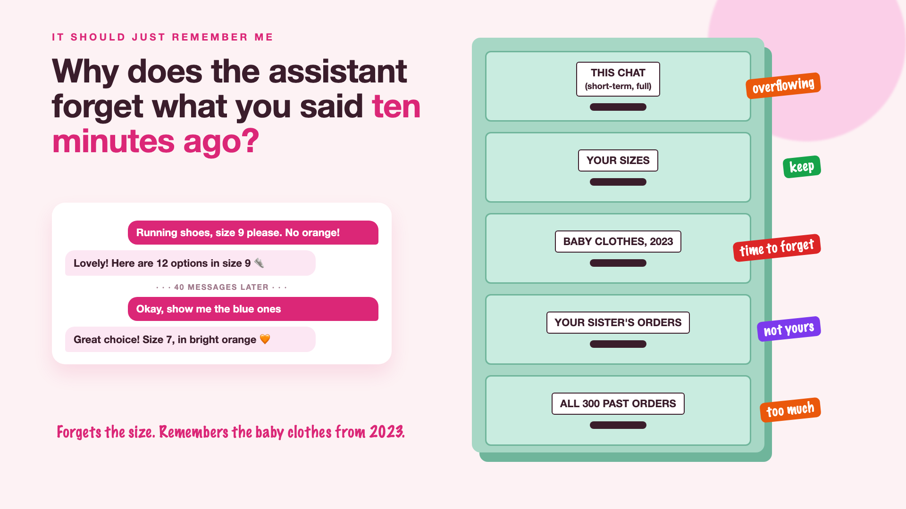

# 1. Why Does the Assistant Forget What You Said Ten Minutes Ago?



*It should just remember me series: the curtain raiser*

"It should just remember everything about the customer."

Picture a fashion site's shopping assistant. A customer starts chatting: "Running shoes, size 9 please. And nothing orange." The assistant shows twelve lovely options in size 9.

Forty messages later, after comparing colours, prices and delivery dates, the customer says, "Okay, show me the blue ones." The assistant cheerfully suggests size 7, in bright orange.

The next week, the same customer comes back. The assistant has forgotten their size completely, but proudly recommends baby clothes, based on a gift they bought in 2023.

Too forgetful in the moment. Too good at remembering the wrong things. Both at once.

## Why AI memory is harder than it sounds

People assume an AI assistant remembers a conversation the way a friend does. It doesn't. It has two very different kinds of memory, and both need design.

- **Short-term memory has a size limit.** The model only sees a fixed amount of recent conversation at a time, its **context window**. Long chats push early details, like "size 9", out of view.
- **Long-term memory doesn't happen by itself.** Remembering a customer next week means deliberately saving facts somewhere, and finding the right ones later.
- **Not everything should be kept.** A one-off gift isn't a preference. Old facts need to expire.
- **Memory is personal data.** Customers may want to see, correct or delete what the assistant remembers. Family members sharing an account shouldn't see each other's details.
- **More memory isn't always better.** Recalling 300 past orders to suggest one T-shirt adds cost, slows things down, and confuses the answer.

Think of a filing cabinet. Some drawers you keep, some you shred, some aren't yours to open, and one is stuffed so full it won't close.

## What sits behind "just remember everything"

Remembering is the easy idea. What makes memory useful is deciding what to keep from a long chat, what to save for next time, what to forget and when, who can see what's remembered, and how much to recall for each answer. The filing cabinet on the cover shows the drawers.

## This is a series: here's what's coming

This write-up is the first in a series. Each one takes one drawer and goes deep, with the same shopping assistant every time. A few of the questions it will answer:

- How does an AI remember you next week? (Long-term memory)
- What should it forget? (Expiring old facts)
- Who can see what the AI remembers about you? (Privacy and control)
- Does more memory mean better suggestions? (Cost and noise)

...and a final write-up with a memory checklist.

## Take this to your next kickoff meeting

1. List the five facts worth remembering about a customer, and the ones that should never be kept.
2. Decide how long each remembered fact lives before it expires.
3. Plan how a customer can see and delete what the assistant remembers, before launch.

A good assistant doesn't remember everything. It remembers the right things, for the right time.

Next write-up (2): **How does an AI remember you next week?** (Long-term memory)

Follow me for the next one. And tell me: what's the strangest thing an app has "remembered" about you?

---

**Post text (copy and paste):**

```
"Size 9, please. Nothing orange."

40 messages later, the shopping assistant suggests size 7, in bright orange. Next week, it forgets the size completely, but remembers a baby gift from 2023.

Get AI memory wrong, and you pay for it:
• Experience: customers repeat themselves, then leave
• Relevance: one-off purchases treated as lifelong preferences
• Privacy: remembered details customers can't see or delete
• Cost: recalling everything for every answer, slowly and expensively

Write-up 1 in my new series, It should just remember me (#RememberMe): why AI memory is harder than it sounds, the drawers every assistant needs, and three things to take to your next kickoff meeting.

What's the strangest thing an app has "remembered" about you?

#AIEngineering #GenAI #AIMemory #AIAgents #RememberMe
```

**Series index (post as the first comment, then pin it):**

```
📌 It should just remember me: series index

1. Why does the assistant forget what you said ten minutes ago? (you're here)
2. How does an AI remember you next week? (next write-up)

I'll keep this comment updated with each link as it goes live.
```
