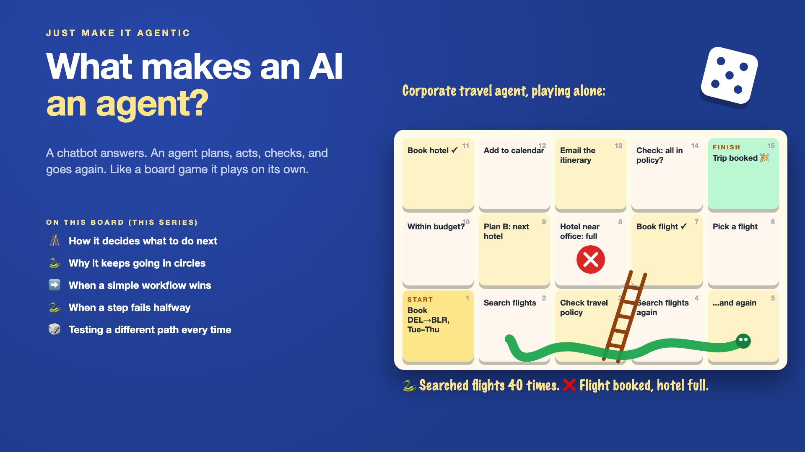

# 1. What Makes an AI an Agent?



*Just make it agentic series: the curtain raiser*

"Let's make it agentic."

Picture a company's travel desk. An employee types: "Book me Delhi to Bengaluru on Tuesday, back Thursday, a hotel near the office, within policy."

A chatbot would reply with some flight options and a link. An **agent** is meant to do the whole job: search flights, check the travel policy, pick one, book it, find a hotel, book that, add it all to the calendar, and email the itinerary. It plans, acts, looks at the result, and decides what to do next, on its own, until the job is done.

In the demo, it's magic. In the first week of real use, one request makes the agent search flights forty times without booking anything. Another books a non-refundable flight, then finds the hotel near the office is full, and stops there.

## Why "agentic" is a big step, not a small upgrade

An agent isn't a smarter chatbot. It's a loop: plan, act, check, repeat. That loop is what makes agents powerful, and what makes them go wrong in new ways.

- **It decides its own next step.** Good when the plan is sensible. Expensive when it isn't.
- **Loops need exits.** Without clear stop rules, an agent can circle forever, spending money each time.
- **Actions have consequences.** A booked flight is real. A half-finished trip is worse than no trip.
- **Not every task needs freedom.** The same weekly Mumbai trip is better as a fixed workflow than a creative agent.
- **Every run can take a different path.** That makes testing much harder than checking one answer.

It's like letting the AI play a board game on its own: ladders when the plan works, snakes when it loops or fails halfway.

## What sits behind "let's make it agentic"

The word is the easy part. What makes an agent dependable is how it plans its next move, when it stops, when a simple workflow is the better choice, what happens when a step fails halfway, and how you test something that takes a different path every time. The board on the cover shows the ladders and the snakes.

## This is a series: here's what's coming

This write-up is the first in a series. Each one takes one square of the board and goes deep, with the same travel-booking agent every time. A few of the questions it will answer:

- How does an agent decide what to do next? (The agent loop)
- Why does my agent keep going in circles? (Stop rules and budgets)
- When is a simple workflow better than an agent? (Workflows vs agents)
- What happens when a step fails halfway? (Recovery)
- How do you test something that takes a different path every time? (Evaluating agents)

...and a final write-up with an agent checklist.

## Take this to your next kickoff meeting

1. Ask whether the task really needs an agent, or whether a fixed workflow would do.
2. Set a step limit and a cost limit for every run, before launch.
3. Decide what happens when the agent fails halfway: undo, retry, or hand over to a person.

An agent isn't a feature. It's a small employee in a loop. Give it a job description, a budget and a manager.

Next write-up (2): **How does an agent decide what to do next?** (The agent loop)

Follow me for the next one. And tell me: what's a task in your company that people want to "make agentic", and should they?

---

**Post text (copy and paste):**

```
"Book me Delhi to Bengaluru, Tuesday to Thursday, hotel near the office, within policy."

The agent searched flights 40 times without booking. Another run booked a non-refundable flight, found the hotel full, and stopped.

Make it agentic without a plan, and you pay for it:
• Cost: loops that spend money on every step
• Risk: real bookings, half finished
• Reliability: a different path every run, and no way to test them all
• Time: building an agent where a simple workflow would have done

Write-up 1 in my new series, Just make it agentic (#JustMakeItAgentic): what makes an AI an agent, why the loop changes everything, and three things to take to your next kickoff meeting.

What's a task in your company that people want to "make agentic", and should they?

#AIEngineering #GenAI #AIAgents #AgenticAI #JustMakeItAgentic
```

**Series index (post as the first comment, then pin it):**

```
📌 Just make it agentic: series index

1. What makes an AI an agent? (you're here)
2. How does an agent decide what to do next? (next write-up)

I'll keep this comment updated with each link as it goes live.
```
