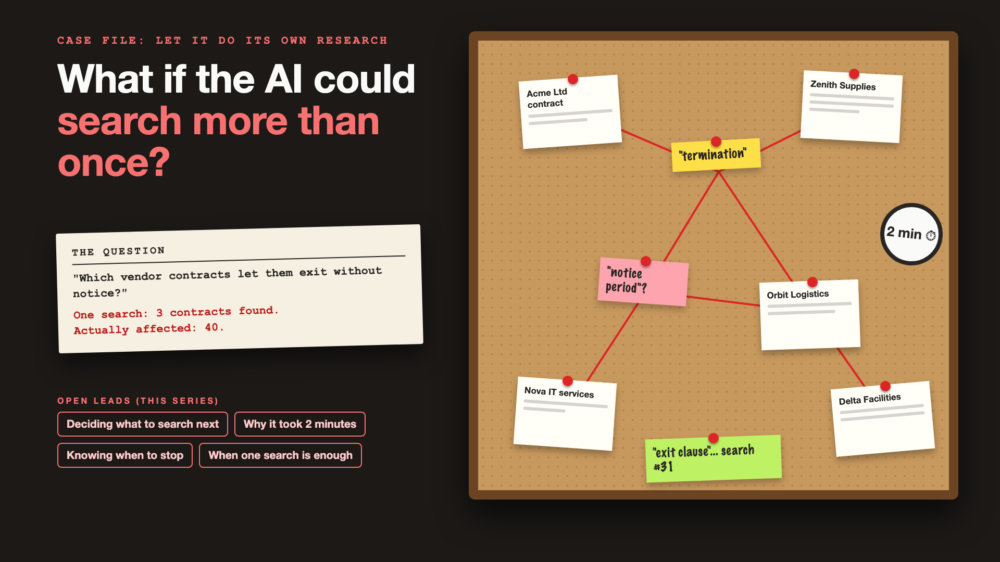

# 1. What If the AI Could Search More Than Once?



*Let it do its own research series: the curtain raiser*

"Let the agent decide what to search."

Picture a company's legal team with hundreds of vendor contracts. The general counsel asks the AI assistant: "Which of our vendor contracts let the vendor exit without notice?"

A typical AI assistant over documents, the kind built with RAG, runs one search, picks the top few passages, and answers. It finds three contracts that mention "termination without notice". It answers confidently: three contracts.

The real number is forty. Some say "terminate for convenience". Some say "exit with immediate effect". Some put the notice period in a schedule at the back. One search, worded one way, was never going to find them all.

## Why one search is rarely enough

Real questions are research, not lookups. A good human researcher doesn't search once. They search, read, learn the right words, and search again.

- **The first search uses the question's words.** Contracts use their own words: "convenience", "immediate effect", "notice period".
- **Answers are spread out.** The clause is on page 4, the notice period is in Schedule B.
- **Good research asks better questions as it goes.** Finding "termination" should lead to searching "notice period" and "exit clause".
- **Every extra search costs time and money.** Thirty searches for one answer can take minutes.
- **Research needs an end.** Without a stopping rule, an agent can keep reading contracts all night.
- **Most questions don't need any of this.** "When does the Acme contract end?" needs one lookup.

Letting the AI search more than once, plan its next search and decide when it has enough is called **agentic RAG**. It's like giving the AI a detective's evidence board: pins, notes and red string between the clues.

## What sits behind "let the agent decide"

The idea is simple. What makes it work is how the agent plans its next search, the extra time and cost of every step, a clear rule for when it has found enough, and the judgement to use plain, single-search RAG when that's all a question needs. The open leads on the cover are the topics of this series.

## This is a series: here's what's coming

This write-up is the first in a series. Each one follows one lead and goes deep, with the same contract-review question every time. A few of the questions it will answer:

- How does the agent decide what to search next? (Query planning)
- Why did a simple question take two minutes? (Latency and cost)
- When does the agent know it has enough? (Stopping rules)
- When is plain RAG good enough? (Choosing the simpler path)

...and a final write-up with an agentic RAG checklist.

## Take this to your next kickoff meeting

1. Collect ten real research questions, and check how many one search answers correctly.
2. Set a limit on searches, time and cost for each question before launch.
3. Route simple lookups to plain search, and save the agent for real research.

One search finds what you asked for. Research finds what you needed.

Next write-up (2): **How does the agent decide what to search next?** (Query planning)

Follow me for the next one. And tell me: what's a question in your business that no single search could ever answer?

---

**Post text (copy and paste):**

```
"Which vendor contracts let the vendor exit without notice?"

One search found 3. The real answer was 40: "terminate for convenience", "immediate effect", notice periods hidden in Schedule B.

Rely on one search for research questions, and you pay for it:
• Risk: a confident answer that misses 37 contracts
• Accuracy: the documents' words aren't the question's words
• Cost and speed: or the opposite, 30 searches for a one-line lookup
• Trust: legal stops using it after the first missed clause

Write-up 1 in my new series, Let it do its own research (#LetItResearch): why one search is rarely enough, what agentic RAG really is, and three things to take to your next kickoff meeting.

What's a question in your business that no single search could ever answer?

#AIEngineering #GenAI #AgenticRAG #RAG #LetItResearch
```

**Series index (post as the first comment, then pin it):**

```
📌 Let it do its own research: series index

1. What if the AI could search more than once? (you're here)
2. How does the agent decide what to search next? (next write-up)

I'll keep this comment updated with each link as it goes live.
```
