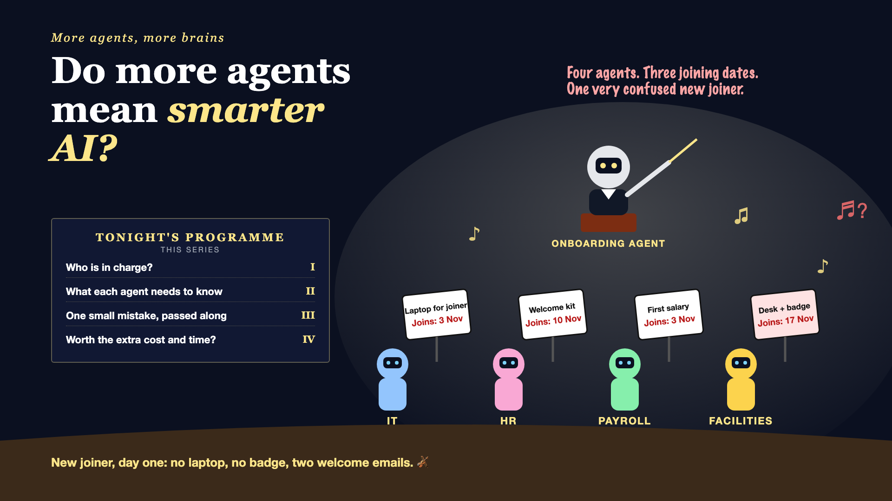

# 1. Do More Agents Mean Smarter AI?



*More agents, more brains series: the curtain raiser*

"Add more agents. It'll get smarter."

Picture new-employee onboarding at a large company. Every new joiner needs a laptop from IT, a welcome kit from HR, a salary set up by payroll, and a desk and badge from facilities. Someone proposes an elegant design: one AI agent for each department, plus an onboarding agent to coordinate them all. Five agents, each an expert.

It looks brilliant on the architecture slide. Then a joiner's start date moves from 3 November to 10 November.

The HR agent hears about it. The IT agent doesn't, and ships the laptop for the 3rd. Payroll sets up the salary from the 3rd. Facilities, reading an older message, books a desk for the 17th. On day one, the new joiner has two welcome emails, no badge, and no laptop.

Each agent did its job. Together, they made a mess.

## Why more agents can mean more confusion

Splitting work across several agents, each with its own speciality, is called a **multi-agent system**. It can be the right design. But every extra agent adds handoffs, and handoffs are where things go wrong, in AI teams just as in human ones.

- **Someone has to be in charge.** Without a clear coordinator, two agents both order the laptop, or neither does.
- **Each agent knows only what it's told.** Too little context and it does the wrong job. Too much and it gets confused.
- **Small mistakes travel.** A wrong department from one agent becomes wrong access, then the wrong desk, further down the line.
- **Every agent has a bill.** Five agents can mean five times the calls, the cost and the waiting.
- **Often, one agent is enough.** An intern's one-week onboarding doesn't need an orchestra.

An orchestra is wonderful with a conductor, a shared score and musicians who listen to each other. Without them, it's just a lot of expensive noise.

## What sits behind "add more agents"

Adding agents is the easy part. What makes a team of agents work is deciding who's in charge, what each agent needs to know, how to stop small errors from spreading, and whether the extra cost and time are worth it compared with a single agent. The programme on the cover lists the four movements of this series.

## This is a series: here's what's coming

This write-up is the first in a series. Each one takes one part of the orchestra and goes deep, with the same onboarding team every time. A few of the questions it will answer:

- Who is in charge? (Orchestration and handoffs)
- What does each agent need to know? (Sharing context)
- Why does one small mistake become a big one? (Compounding errors)
- Is it worth the extra cost and time? (When one agent is enough)

...and a final write-up with a multi-agent checklist.

## Take this to your next kickoff meeting

1. Ask what one well-designed agent can't do, before agreeing to several.
2. Name the agent in charge, and the single source of truth all of them read, like the joining date.
3. Add a check between agents, so a mistake stops at the first handoff.

More agents don't make AI smarter. Better coordination does.

Next write-up (2): **Who is in charge?** (Orchestration and handoffs)

Follow me for the next one. And tell me: where have you seen "more agents" make a system worse, not better?

---

**Post text (copy and paste):**

```
Five AI agents for onboarding: IT, HR, payroll, facilities, and a coordinator.

The joining date moved. HR heard. IT didn't. Facilities read an old message. Day one: two welcome emails, no badge, no laptop.

Add agents without coordination, and you pay for it:
• Accuracy: one small mistake passed from agent to agent
• Cost: five agents, five times the calls
• Speed: every handoff adds waiting
• Experience: a new joiner's first impression, ruined

Write-up 1 in my new series, More agents, more brains (#MoreAgents): why more agents can mean more confusion, what makes an AI team work, and three things to take to your next kickoff meeting.

Where have you seen "more agents" make a system worse, not better?

#AIEngineering #GenAI #MultiAgent #AIAgents #MoreAgents
```

**Series index (post as the first comment, then pin it):**

```
📌 More agents, more brains: series index

1. Do more agents mean smarter AI? (you're here)
2. Who is in charge? (next write-up)

I'll keep this comment updated with each link as it goes live.
```
