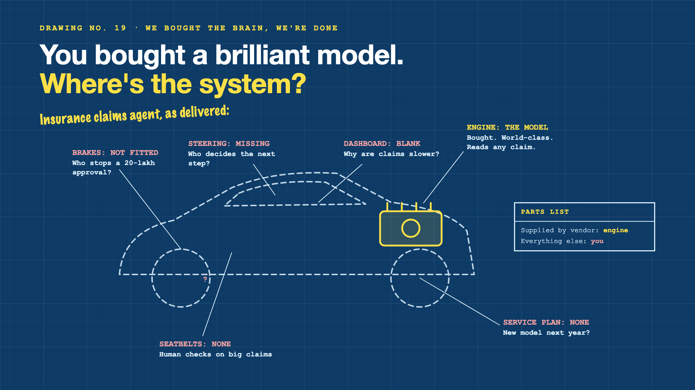

# 1. You Bought a Brilliant Model. Where's the System?



*We bought the brain, we're done series: the curtain raiser*

"The vendor ships the model, so we're done."

Picture an insurance company buying access to one of the best AI models available. In a demo, it reads a motor claim (photos, the repair estimate, the policy document) and explains, in perfect English, whether the claim looks covered and what's missing. The room is impressed. The model is genuinely brilliant.

The project plan says: connect the model, launch in a month.

Then the questions start. Who decides what happens after the model reads the claim: approve, ask for documents, or send it to an investigator? What stops it approving a 20-lakh claim on its own? How will anyone know why claims got slower last Tuesday? And what happens next year, when the vendor releases a new model and the old prompts behave differently?

The vendor sold an engine. Nobody ordered the car.

## Why the model isn't the system

A model is the brain: it reads, reasons and writes. Everything that turns that brain into a dependable claims process is built around it, and it's yours to build. Engineers call that surrounding system the **harness**.

- **Someone has to steer.** The model can suggest a next step. Code has to decide the order: read the claim, check the policy, request documents, approve or escalate.
- **Brakes are not optional.** Limits on amounts, human approval for big claims, and checks before money moves.
- **You need a dashboard.** Logs, tests and cost tracking, so you can see what it's doing and why.
- **Seatbelts protect people.** Human review where a wrong decision hurts a customer.
- **Cars need servicing.** Models change, policies change, prompts drift. Someone owns the upkeep.

The vendor supplies a world-class engine. The brakes, steering, dashboard, seatbelts and service plan are all on your side of the parts list.

## What sits behind "we bought the model"

The model is the visible part, and the part with the press release. What makes an AI agent production-ready is the harness: deciding what happens next, setting the brakes, building the dashboard, adding human checks, and planning who maintains it all after launch. The blueprint on the cover shows which parts arrive in the box, and which don't.

## This is a series: here's what's coming

This write-up is the first in a series. Each one takes one part of the harness and goes deep, with the same claims-processing agent every time. A few of the questions it will answer:

- Who decides what happens next? (Planning and control flow)
- Where are the brakes? (Guardrails, limits and human checks)
- What does the dashboard show? (Observability, evals and cost)
- Who maintains it after launch? (Updates, model swaps and ownership)

...and a final write-up with a harness checklist.

## Take this to your next kickoff meeting

1. Draw the whole claims process on one page, and circle the parts the model doesn't do.
2. Set the money limit above which a human must approve, before the first real claim.
3. Name the team that owns the harness after launch, and budget for it.

You can buy a brilliant brain. You still have to build the body it lives in.

Next write-up (2): **Who decides what happens next?** (Planning and control flow)

Follow me for the next one. And tell me: what share of your last AI project was the model, and what share was everything around it?

---

**Post text (copy and paste):**

```
"The vendor ships the model, so we're done."

The model reads an insurance claim perfectly. Then: who decides the next step? What stops a 20-lakh approval? Why were claims slower last Tuesday? What happens when the model changes next year?

Treat the model as the whole system, and you pay for it:
• Risk: decisions with no brakes and no human check
• Reliability: no control over what happens after the model answers
• Visibility: no dashboard to explain problems
• Cost: a rebuild every time the vendor releases a new model

Write-up 1 in my new series, We bought the brain, we're done (#BrainNotBody): why the model isn't the system, what the harness around it does, and three things to take to your next kickoff meeting.

What share of your last AI project was the model, and what share was everything around it?

#AIEngineering #GenAI #AIAgents #InsurTech #BrainNotBody
```

**Series index (post as the first comment, then pin it):**

```
📌 We bought the brain, we're done: series index

1. You bought a brilliant model. Where's the system? (you're here)
2. Who decides what happens next? (next write-up)

I'll keep this comment updated with each link as it goes live.
```
