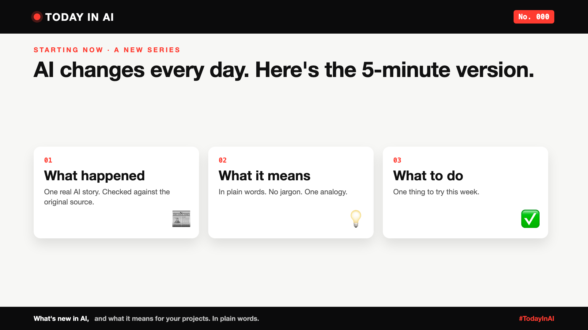

# Today in AI: curtain raiser post

A short LinkedIn post (not an article) to announce the daily series. Attach the image.



**Post text (copy and paste):**

```
AI changes every day.

New models on Monday. A big mistake on Tuesday. A "this changes everything" on Wednesday. And by Thursday, nobody remembers Monday.

Most of us don't need more AI news. We need to know which story actually matters, and what to do about it.

So I'm starting something small: Today in AI.

Each post: one AI story that matters. 5 minutes. Three questions:
1. What happened? (Checked against the original source, with credits.)
2. What does it mean, in plain words?
3. What's one thing you can do this week?

It's written so a student and a CEO can read the same post, and both get something out of it.

No hype. No jargon. No 47-tool listicles.

First up, No. 001: what happens when your AI agent visits someone else's website?

Follow along, and tell me: what AI story confused you most this month?

#AI #GenAI #TechNews #AIForEveryone #TodayInAI
```

**Alternative opening lines (pick one if you prefer):**

- "I read the AI news for hours, so you can read it in 5 minutes."
- "AI news is a firehose. I'm offering a glass of water."
- "One AI story a day. The kind you can explain to your intern and your CEO."
